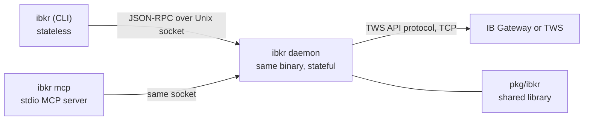

# ibkr

[](https://github.com/osauer/ibkr/actions/workflows/ci.yml)
[](https://github.com/osauer/ibkr/releases/latest)
[](go.mod)
[](https://pkg.go.dev/github.com/osauer/ibkr)
[](LICENSE)

**Read-only Interactive Brokers access for humans and agents.** Ask what you own, how exposed you are, what the market backdrop looks like, or how large a planned trade should be, or simply request live market data.

One Go binary gives you a shell CLI, a local stdio MCP server, and a Go library. Account data stays on the machine running IB Gateway or TWS unless you choose to pass it to an MCP host.

The important shape:

- **Local first.** The daemon speaks to your local IB Gateway / TWS and listens on a Unix socket.
- **Agent friendly.** Claude Desktop, Claude Code, Cursor, Continue, Zed, or any MCP host can call the same read-only tools.
- **Structurally read-only.** Order placement, cancellation, and modification are absent from the CLI/MCP surface and refused at multiple lower layers. [Details](#safety).
- **One JSON contract.** CLI, MCP, and library callers see the same daemon responses.

With `ibkr mcp` wired up, you can ask:

> *"What's in my IBKR account and how am I doing this week?"*
> *"Show me my AAPL exposure, including option deltas."*
> *"How does the market regime look today?"*
> *"If I buy 100 MSFT at 418 with a stop at 408, what's the EUR risk?"*

Or use the shell directly:

```sh
ibkr status
ibkr positions --by underlying
ibkr regime
ibkr quote SPY --watch
ibkr size --symbol AAPL --entry 207.50 --stop 202.50 --risk-pct 1
```

**Contents** — [Install](#install-in-two-commands) · [What you get](#what-you-get) · [Pick your path](#pick-your-path) · [How it works](#how-it-works) · [Configure](#configure) · [Safety](#safety) · [Other install paths](#other-install-paths) · [Troubleshooting](#troubleshooting)

## Install in two commands

```sh
curl -fsSL https://raw.githubusercontent.com/osauer/ibkr/main/install.sh | sh
ibkr setup claude-desktop
```

The installer detects your OS/arch, fetches the matching tarball from the latest release, verifies the SHA-256, drops `ibkr` in `~/.local/bin`, clears macOS Gatekeeper quarantine, and adds `~/.local/bin` to your shell rc if it isn't on PATH. When `gpg` and `SHA256SUMS.asc` are both available, bootstrap also verifies the PGP signature; after install, `ibkr update` is stricter and refuses unsigned releases. The second command writes the MCP server entry into Claude Desktop's config — quit Claude (⌘Q) and relaunch. Skip it if you only want the shell tool. [Other install paths.](#other-install-paths)

**Prerequisites.** A running [IB Gateway](https://www.interactivebrokers.com/en/trading/ibgateway-stable.php) 10.37+ or TWS (paper or live) on the same machine. Auto-discovered on the four standard ports. An **IBKR Pro** account (IBKR Lite cannot use the TWS API).

## What you get

- **Account and positions.** Net liquidation, buying power, cash, margin, daily P&L, positions, option Greeks, per-underlying grouping, and portfolio-level delta/theta/gamma/vega rollups. Multi-currency accounts include FX exposure.
- **Quotes and history.** Snapshot quotes, coalesced stock/ETF streaming, daily OHLCV bars, previous close, day change, and data freshness (`live`, `frozen`, `delayed`, `delayed-frozen`).
- **Options.** Expiry lists with ATM IV and implied move, strike grids with call/put quotes, deltas, and open interest. Option snapshots are supported; option streaming is not exposed.
- **Scanners.** Built-in market scans for movers, losers, unusual volume, gaps, high IV rank, and option volume. Agents can also compose ad-hoc scans without writing config.
- **Position sizing.** Fixed-fractional sizing against live NLV, with optional target, R-multiple, and breakeven win rate. Pure math; never an order ticket.
- **Market breadth.** S&P 500 participation from constituent daily bars: percent above 50-DMA, percent above 200-DMA, and fresh 52-week highs/lows. A fresh cache is instant; first-ever cold start can take about an hour because of IBKR pacing.
- **Dealer gamma.** Best-effort SPY+SPX zero-gamma and concentration view, with scope controls and entitlement-graceful fallback to SPY when SPX data is unavailable. Treat the signed level as a regime hint, not a precise trading level.
- **Risk regime.** One call returns the five-indicator dashboard: VIX term structure, HYG/SPY divergence, USD/JPY weekly move, SPY+SPX gamma, and S&P 500 breadth. Heavy rows report `computing` instead of pretending stale data is fresh.

Every data/query command supports `--json`; local lifecycle commands such as `setup`, `update`, `mcp`, and `daemon` are intentionally human/transport oriented. For field-level schemas and edge cases, see the [agent skill schema notes](skills/ibkr/schemas.md), [MCP tools reference](docs/reference/mcp-tools.md), and [concept docs](docs/concepts.md).

## Pick your path

### Claude Desktop, Cursor, Continue, Zed

`ibkr mcp` is a stdio MCP server. Every CLI verb an LLM should ever call has a matching MCP tool (local lifecycle verbs like `setup`, `update`, `mcp`, `daemon`, and `version` are intentionally excluded), and `make check` fails if the surfaces drift. The server also exposes quotes for stocks and ETFs as an MCP resource:

- `ibkr://quote/{symbol}`

`resources/read` returns one snapshot for that URI; `resources/subscribe` delivers coalesced ticks via `notifications/resources/updated` until you `resources/unsubscribe` or close the stdio. The resource shape is documented in [docs/reference/mcp-resources.md](docs/reference/mcp-resources.md). `ibkr setup claude-desktop` handles Claude Desktop end-to-end. For other clients, paste this into the client's MCP config (path varies):

```json
{
  "mcpServers": {
    "ibkr": {
      "command": "/ABSOLUTE/PATH/TO/ibkr",
      "args": ["mcp"]
    }
  }
}
```

The `command` must be the absolute path. `~` is not expanded by `exec` and `$PATH` is not consulted. `which ibkr` gives you the right value. After upgrading the binary, fully quit and relaunch the client — it caches the spawned server process.

`claude.ai` (web) accepts only remote MCP servers and cannot reach a local IB Gateway. Use Desktop.

Logs (macOS, Claude Desktop): `~/Library/Logs/Claude/mcp-server-ibkr.log`.

### Claude Code

Inside a standalone Claude Code session:

```
/plugin marketplace add osauer/ibkr
/plugin install ibkr@ibkr
```

Or — for **Claude for Mac**'s embedded Claude Code pane, which doesn't expose `/plugin` slash commands — from a regular terminal:

```sh
claude plugin marketplace add osauer/ibkr
claude plugin install ibkr@ibkr
```

The plugin carries a skill, a `PreToolUse` hook that hard-blocks trading verbs (failing closed if `jq` is missing from PATH), and a `SessionStart` hint when the binary isn't installed. The skill's `allowed-tools` pre-allows the read-only patterns once the skill activates. For a global allowlist that fires *before* the skill activates, copy `settings/ibkr.settings.json` into `~/.claude/settings.json` by hand.

**The plugin doesn't ship the binary.** It only carries the skill, hooks, and manifest — you still need the `ibkr` binary on PATH from [Install in two commands](#install-in-two-commands). The two have independent release cadences and independent update paths:

```sh
# Binary release (new MCP tool descriptions are baked into the binary):
curl -fsSL https://raw.githubusercontent.com/osauer/ibkr/main/install.sh | sh

# Plugin release (new skill commands, settings, hooks):
claude plugin update ibkr@ibkr
```

Restart the host (Claude for Mac, standalone Claude Code session, Cursor, …) after either update so it respawns the MCP server subprocess with the new descriptions and reloads the skill at the next session start.

### The shell

```sh
$ ibkr account --json | jq '.net_liquidation, .base_currency'
$ ibkr quote AAPL,MSFT --json | jq '.[] | {sym: .symbol, last: .last, chg: .change_pct}'
$ ibkr positions --by underlying --json | jq '.portfolio.effective_delta'
$ ibkr chain NVDA --json | jq '.expiries[] | select(.iv > 0.6)'
$ ibkr size --symbol AAPL --entry 207.50 --stop 202.50 --risk-pct 1
```

`ibkr --help` lists subcommands; `ibkr <cmd> --help` lists flags. `ibkr status` first if anything looks off.

### Go and other agent SDKs

`pkg/ibkr` speaks the TWS API protocol directly:

```go
import "github.com/osauer/ibkr/pkg/ibkr"

cfg := ibkr.DefaultConfig()    // 127.0.0.1:4001
cfg.Port = 4002                // paper

c := ibkr.NewConnector(&ibkr.ConnectorConfig{
    ServiceName: "myapp",
    PoolConfig:  &ibkr.PoolConfig{ClientIDs: []int{15}, BaseConfig: cfg},
})
if err := c.Start(ctx); err != nil { return err }

snap, _ := c.RequestAccountSummary(ctx, 5*time.Second)
fmt.Printf("NLV: %.2f %s\n", *snap.NetLiquidation, snap.Currency)
```

From Python, TypeScript, or Rust, shell out to the CLI: subprocess in, JSON out. Wrap each `ibkr <cmd> --json` invocation as a function and register it with your model's tool-call API.

## How it works



The CLI and MCP server are short-lived clients. The daemon is the stateful half: it holds the IBKR connection, caches contract details, fans out quote subscriptions, and serves JSON-RPC over a local Unix socket. It autospawns on first use and idles out after fifteen minutes unless you run it in the foreground.

One singleton daemon means your shell, Claude Desktop, Claude Code, and other MCP clients share one gateway connection and one IBKR client-ID slot. The MCP server keeps its daemon connection open while the host is running, so tool calls are fast and the daemon stays alive until the host quits.

`pkg/ibkr` is a clean-room Go implementation of the read-side TWS protocol. Full coverage details live in [docs/reference/protocol.md](docs/reference/protocol.md), and the public package docs live in [pkg/ibkr/doc.go](pkg/ibkr/doc.go).

## Configure

No config file is required. The daemon TCP-probes `4001` (Gateway live), `4002` (Gateway paper), `7496` (TWS live), `7497` (TWS paper), picks the first responder, and falls over to alternates if the first one accepts TCP but never completes the handshake. The account is auto-detected via `managedAccounts`. Default client ID is `15`.

Write a config to **pin** a dimension. Anything you write is binding; anything you omit stays auto. Default path: `$XDG_CONFIG_HOME/ibkr/config.toml`, falling back to `~/.config/ibkr/config.toml`.

```toml
[gateway]
host       = "127.0.0.1"
port       = 4001          # binding: skip the probe
client_id  = 15
account    = ""            # empty = auto-detect via managedAccounts
tls        = false         # binding: no TLS fallback

[daemon]
idle_timeout = "15m"
log_level    = "info"

[scans.top-movers]
type     = "TOP_PERC_GAIN"
exchange = "STK.US.MAJOR"
limit    = 20
```

`ibkr status` shows what the daemon ended up using and where each value came from (`pinned` or `discovered`).

**TLS semantics.** A pinned `tls` value (true or false) is strict. An omitted `tls` means "auto": plain first, TLS on no-handshake-data.

**Strict keys.** Unknown top-level keys or sections fail at startup with a message that names them — your config can't silently drop fields. Supported sections: `[gateway]`, `[daemon]`, `[spx]`, `[scans.<name>]`.

The full per-field reference (TOML sections + `IBKR_*` env vars) is auto-generated at [docs/reference/config.md](docs/reference/config.md). Concept and mental-model docs for the indicators live at [docs/concepts.md](docs/concepts.md); the agentic (Claude / MCP) walkthrough is at [docs/guides/agentic-use.md](docs/guides/agentic-use.md); marketplace packaging notes live at [docs/guides/marketplace-readiness.md](docs/guides/marketplace-readiness.md); data locality is summarized in [PRIVACY.md](PRIVACY.md).

### Adding scanners

Two paths, depending on who's calling:

**Humans — add a preset to `config.toml`.** Use this when you want a stable shorthand you'll call by name:

```toml
[scans.tech-gainers]
type     = "TOP_PERC_GAIN"
exchange = "STK.NASDAQ"
limit    = 25
```

Then `ibkr scan tech-gainers`. **Caveat:** writing **any** `[scans.*]` block makes the seven built-in defaults disappear — the `[scans]` table is replace-not-merge. Copy the defaults from [internal/config/config.go](internal/config/config.go) into your file if you want to keep them. Daemon restart (`pkill -x ibkr`; next call respawns) is required for new presets to be visible.

**Agents — use the ad-hoc form, no config write needed:**

```
ibkr scan --type TOP_PERC_GAIN --exchange STK.NASDAQ --limit 25 --json
```

Ad-hoc rows are capped at 50 (vs. preset's user-set limit) to keep an agent from accidentally pulling thousands.

**Finding the right `scanCode` and `locationCode`.** The TWS Market Scanner UI hides these strings behind human labels. Dump your gateway's actual catalog with:

```
ibkr scan params --instrument STK [--json]
```

The catalog varies by gateway version and by your market-data subscriptions — `scanCode`s like `HIGH_OPT_IMP_VOLAT_OVER_HIST` require US options data. `--instrument STK` narrows to stock scans; omit for everything. Add `--raw` to get the full XML (~200 KB–2 MB) if you need a less-common field. There's no need to memorize the values — the catalog is the source of truth.

## Safety

`ibkr` is the stable read-only line. Five independent layers refuse `order`, `trade`, `cancel`:

1. Default `pkg/ibkr` builds return `ErrTradingDisabled` from `Connection.PlaceOrder`, `Connection.CancelOrder`, `Connector.SubmitOrder`, and `Connector.CancelOrder` before any wire write. The raw encoder is available only to explicit downstream forks built with `-tags trading`.
2. The daemon's order-handler dispatch returns `ErrTradingDisabled` for both `MethodOrderPlace` and `MethodOrderCancel` ([internal/daemon/trading_disabled.go](internal/daemon/trading_disabled.go)).
3. The bundled [settings/ibkr.settings.json](settings/ibkr.settings.json) denies the verbs in `permissions.deny`.
4. The plugin's `PreToolUse` hook hard-blocks the verb patterns and fails closed if `jq` is missing from PATH.
5. A unit test in `internal/mcp` refuses to ship the MCP server with any tool whose name contains `order`, `trade`, `cancel`, `submit`, or `place`.

Per [semver](https://semver.org/), v1.x keeps the CLI/JSON/MCP read-only surfaces stable except for documented minor additions and patch fixes.

## Other install paths

- **`go install`**: `go install github.com/osauer/ibkr/cmd/ibkr@latest`. Requires Go 1.26+.
- **Different install dir**: `IBKR_INSTALL_DIR=/usr/local/bin sh install.sh`. The installer won't touch your shell rc when you override; manage PATH yourself.
- **Inspect the installer first**: `curl -fsSL https://raw.githubusercontent.com/osauer/ibkr/main/install.sh -o install.sh && less install.sh && sh install.sh`.
- **Manual download**: pick a tarball from the latest [release](https://github.com/osauer/ibkr/releases/latest). Each contains `ibkr` plus `LICENSE` and `README.md`. Verify `SHA256SUMS.asc` against the release-signing key, then verify the tarball against `SHA256SUMS`; see [SECURITY.md](SECURITY.md#release-integrity-v100).
- **Local build**: `git clone … && make install`.
- **Reproducible builds**: release binaries are built with `-trimpath -buildvcs=false` and stamp the version, commit, and commit date via `-ldflags`. Rebuilding the same tag (`make release-binaries RELEASE_VERSION=vX.Y.Z`) should produce byte-identical binaries on the same Go/toolchain pair. The tarball checksum can still vary with tar/gzip metadata; verify downloaded release assets against the published `SHA256SUMS`.
- **Self-update**: `ibkr update` fetches the next stable release, verifies the PGP signature on `SHA256SUMS`, SHA-verifies the tarball, and atomically replaces `~/.local/bin/ibkr` (prior binary stashed as `.bak` for one-step rollback). See [docs/guides/updating.md](docs/guides/updating.md) for headless flag matrix, daemon-restart semantics, and how the runtime S&P-500 constituent refresh works.

Windows is not supported — the daemon uses Unix-only primitives (setsid, flock, AF_UNIX sockets). WSL works.

## Testing

```sh
make check      # gofmt + go vet + staticcheck + govulncheck + plugin/parity checks
make test       # check + unit tests + integration tests against a live gateway
```

`make check` is the binding gate. It fails on stdlib vulnerabilities, so an outdated Go toolchain is a build failure. The lint/vuln tools are pinned in `go.mod` and run via `go tool`, so CI and local checks use the same versions.

Integration tests under `test/integration/` connect to the live IB Gateway on `127.0.0.1:4001` and skip cleanly when it isn't reachable, so `go test ./...` doesn't hang on a laptop with no gateway. Override the port with `IBKR_TEST_PORT=4002 make test`.

No mock daemons. `pkg/ibkr/protocoltest/` is a wire-level encoder/decoder spec used by unit tests. Behavioural verification runs against a real IB Gateway.

## Troubleshooting

**"gateway not responding to TWS handshake within 12s".** The gateway accepts your TCP connection but never replies to the v100 handshake. Almost always the API socket is disabled. Launch TWS once, accept "Enable ActiveX and Socket Clients", quit TWS, restart Gateway. The flag carries over via shared `~/Jts/<userdir>/ibg.xml`. It also silently un-ticks itself when more than one of TWS / IB Gateway / IBKR Desktop is launched against the same login — if it keeps coming back, run only one of them.

**"no IBKR listener found on 127.0.0.1 ports ...".** Auto-discovery probed all four standard ports and got nothing. The error message tells you which case you're in: if TWS / IB Gateway / IBKR Desktop is running, the API socket is closed (checkbox unchecked, login pending, or non-default socket port — pin it in `[gateway]`); if nothing is running, just start one and the daemon reconnects automatically. On a non-loopback host, set `host = "192.168.x.y"` explicitly — auto-discovery only probes loopback.

**"none of N discovered endpoint(s) completed TWS handshake".** Both Gateway and TWS are running, both accept TCP, but neither completes the API handshake. Usually a stale Gateway window from earlier in the day plus a freshly logged-in TWS. The status output names every endpoint that was tried. Quit the one you don't need.

**`daemon socket did not appear`.** The daemon crashed during startup. Check `~/.local/state/ibkr/ibkr-daemon.log`. Common causes: gateway not running, configured `client_id` already in use, wrong port. Orphaned sockets from crashed daemons are handled automatically.

**Quotes time out.** Strict live entitlements, market closed. The daemon defaults to `SetMarketDataType(2)` (frozen), which returns the last-known price; with `live` only, snapshots stay empty out of trading hours. Loosen the gateway's market-data permissions.

**`use of closed network connection` during handshake.** IB Gateway rate-limits fast handshake retries. Wait ~30 seconds before restarting.

**CLI vs daemon version skew warning.** `pkill -x ibkr`, then re-invoke any subcommand. The daemon autospawns from the new binary.

**Capturing the wire protocol for diagnostics.** Set `IBKR_WIRE_INTERCEPTOR=1` to enable the in-process recorder; pair with `IBKR_WIRE_LOG_PATH=/path/to/wire.jsonl` to also persist every frame as JSON-lines. `IBKR_WIRE_RING_SIZE=N` sizes the in-memory ring (default 256). For raw bytes, `IBKR_PACKET_LOG_TEMPLATE=/path/to/packets.bin` enables the lower-level packet logger. All four are off by default. Captured frames carry account-sensitive data — see [SECURITY.md §Diagnostic data sensitivity](SECURITY.md#diagnostic-data-sensitivity) before sharing logs.

## Disclaimer & trademarks

This project is an **independent, third-party client** for Interactive Brokers' [publicly documented TWS API](https://interactivebrokers.github.io/). It is not built, endorsed, sponsored, or supported by Interactive Brokers Group, Inc., or any of its affiliates.

- "Interactive Brokers", "IBKR", "TWS", and "IB Gateway" are trademarks or registered trademarks of Interactive Brokers Group, Inc. or its affiliates. They are used here nominatively, solely to identify the brokerage and the API this project connects to.
- `pkg/ibkr` is a clean-room Go re-implementation of the TWS wire protocol. **No code, libraries, or jars distributed by Interactive Brokers are included or redistributed in this project.**
- This project does not store, cache, or redistribute IBKR market data. All data is read live from a gateway you run locally, against your own account, and never leaves your machine via this code.
- Connecting to IBKR via the TWS API requires an **IBKR Pro** account; IBKR Lite does not include API access.
- Nothing here is investment advice. Use at your own risk; the MIT license's AS IS clause applies in full.

If you are Interactive Brokers and have a concern with anything in this repository, please open a GitHub issue and we will respond promptly.

## License

MIT. See [LICENSE](LICENSE).
