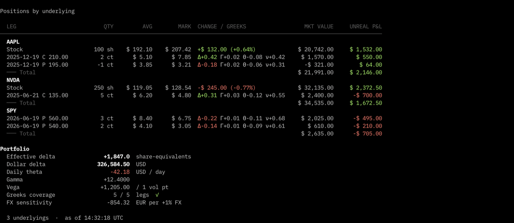
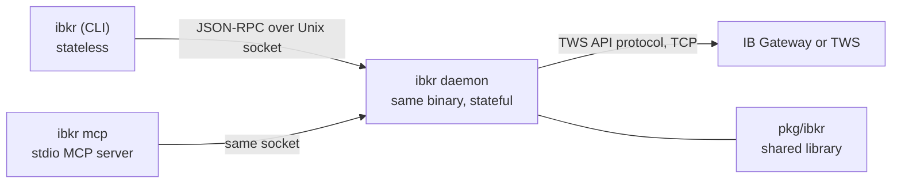

# ibkr

[](https://github.com/osauer/ibkr/actions/workflows/ci.yml)
[](https://github.com/osauer/ibkr/releases/latest)
[](go.mod)
[](LICENSE)

**A read-only client for your Interactive Brokers account.** One Go binary, three surfaces — CLI, stdio MCP server, Go library — all returning the same JSON. No Python or Java runtime to install.



```sh
$ ibkr account --watch        # in-place refresh, ^C to stop

$ ibkr quote AAPL --json | jq '{last, prev_close, change, change_pct}'
{
  "last": 207.42,
  "prev_close": 206.10,
  "change": 1.32,
  "change_pct": 0.64
}

$ ibkr quote SPY --watch        # streaming, ^C to stop
  14:32:01    583.18  1.2k    583.21  800     583.20
  14:32:02    583.19    900   583.22  650     583.21
  14:32:03    583.21  1.1k    583.24  720     583.23
```

From a Claude Desktop or Claude Code session with `ibkr mcp` wired up:

> *"What's in my IBKR account and how am I doing this week?"*
> *"Show me my AAPL position with today's P&L and the option-leg deltas."*
> *"What expiries are available for NVDA, with ATM IV?"*
> *"If I buy 100 MSFT at 418 with a stop at 408, what's the EUR risk?"*

Read-only is structural — four independent layers refuse `order`, `trade`, `cancel`. [Details](#safety).

**Contents** — [Install](#install-in-two-commands) · [Features](#what-you-get) · [Pick your path](#pick-your-path) · [Architecture](#architecture) · [Protocol coverage](#protocol-coverage) · [Configure](#configure) · [Safety](#safety) · [Other install paths](#other-install-paths) · [Testing](#testing) · [Troubleshooting](#troubleshooting)

## Install in two commands

```sh
curl -fsSL https://raw.githubusercontent.com/osauer/ibkr/main/install.sh | sh
ibkr setup claude-desktop
```

The installer detects your OS/arch, fetches the matching tarball from the latest release, verifies the SHA-256, drops `ibkr` in `~/.local/bin`, clears macOS Gatekeeper quarantine, and adds `~/.local/bin` to your shell rc if it isn't on PATH. The second command writes the MCP server entry into Claude Desktop's config — quit Claude (⌘Q) and relaunch. Skip it if you only want the shell tool. [Other install paths.](#other-install-paths)

**Prerequisites.** A running [IB Gateway](https://www.interactivebrokers.com/en/trading/ibgateway-stable.php) 10.37+ or TWS (paper or live) on the same machine. Auto-discovered on the four standard ports. An **IBKR Pro** account (IBKR Lite cannot use the TWS API).

## What you get

- **Account snapshot.** NLV, buying power, cash, margin, available funds, gross position value, session unrealized/realized P&L, the margin cushion, and IBKR's start-of-trading-day Daily P&L (account-level) — rendered in the account's base currency with the right symbol (`€`, `$`, `£`, `¥`, or the ISO code). Margin accounts also get the look-ahead block (post-overnight-cycle projections of init/maint/available/excess), which catches "fine intraday, blown by 5pm" cases. Multi-currency accounts get a `currency_exposure` block: one row per non-base holding with the gateway-reported FX rate and the base-currency conversion.
- **Positions with live Greeks.** Each option leg carries delta, gamma, theta, vega, plus its own bid/ask, IV, and prior settle — so wide spreads on illiquid contracts are visible and option-level daily P&L is unambiguous. A `DAY P&L` column carries IBKR's per-conId start-of-trading-day delta (from `reqPnLSingle`) for both stocks and options — one consistent metric across the book. The column always renders; nil rows show em-dash so the field is discoverable on the first call. A `portfolio` block aggregates effective delta in share-equivalents, dollar delta, daily theta, gamma, and vega, with an FX-sensitivity rollup for multi-currency books. `--by underlying` consolidates stock and option legs per name. `ibkr positions --watch` re-polls in place.
- **Quotes — snapshot and streaming.** `ibkr quote AAPL` for a snapshot; `ibkr quote AAPL --watch` for coalesced live ticks. Prev-close, daily change, and change-% on every row (pre-market: yesterday's close arrives even when regular-session ticks haven't started). Options addressed as `SYM YYMMDD C|P STRIKE`. Streaming is also exposed as an MCP resource subscription — multiple watchers share one IBKR market-data line per symbol.
- **Option chains.** `ibkr chain SPY` lists expiries with ATM implied vol, days-to-expiry, and the 1-σ **implied move** (`spot × IV × √(DTE/365)` — the desk-standard "expected move by expiry" used for earnings sizing and strike selection) by default; `--expiry 2025-12-19` switches to the strike grid. Per-strike call/put delta surfaces on the wire. Chain IV is cached daemon-side with phase-aware TTL (60 s during RTH, 4 h otherwise) so repeated lookups within a decision pause cost zero gateway round trips.
- **Daily OHLCV history.** `ibkr history AAPL --days 30`.
- **Scanners — preset or ad-hoc.** Seven built-in presets (`top-movers`, `top-losers`, `most-active`, `unusual-vol`, `gappers`, `high-iv-rank`, `unusual-opt-vol`) covering direction, volume, opening gaps, and option-flow signals. `ibkr scan <preset>` for the shorthand; `ibkr scan --type SCANCODE --exchange LOCATIONCODE` for ad-hoc queries; `ibkr scan params [--instrument STK]` to dump the gateway's valid `scanCode` / `locationCode` catalog. Add your own presets in `config.toml`.
- **Position sizing.** `ibkr size --symbol AAPL --entry 207.50 --stop 202.50 --risk-pct 1` does fixed-fractional math against live NLV. Add `--target` to also get the **R-multiple** (reward:risk) and the breakeven win rate — the standard "is this trade worth taking" filter (≥ 2R typical). Pure arithmetic; never proposes or attempts an order.
- **S&P 500 market breadth.** `ibkr breadth` reads S&P DJI's `S5FI` index (% of S&P 500 constituents above their 50-day SMA) and returns the current value plus a ~30-day sparkline. Sourced from the `INDEX` exchange — no constituent fan-out, no daemon-side SMA recomputation. Honest about feed state via `data_type`. Useful as an input to a risk-regime check; see `docs/specs/risk-regime-dashboard.md` for one such dashboard the daemon's two new endpoints (this one and the next) feed directly.
- **SPX dealer zero-gamma — best effort.** `ibkr gamma` estimates the SPX price level where aggregate dealer gamma flips sign, using the standard [Perfiliev recipe](https://perfiliev.com/blog/how-to-calculate-gamma-exposure-and-zero-gamma-level/) against IBKR's option chain (6 nearest expirations, ATM ±10 %, BS-recomputed gamma across a spot sweep). The compute is heavy — multi-minute fan-out across hundreds of legs; the first caller of an NY trading session kicks a background job and gets `status: "computing"` with an ETA, while subsequent callers receive the cached result. The result carries two signals on purpose: the signed Perfiliev `zero_gamma` (a regime hint that can invert near covered-call-ETF flow or autocall barriers) and a sign-agnostic `gamma_total_abs` / `top_strikes` view that's robust to the dealer-positioning assumption. **Treat the number as a regime hint, not a precise level.** Full methodology, limitations, and a manual calibration ritual against SpotGamma's public posts are documented in `docs/specs/risk-regime-dashboard.md`.
- **Risk-regime snapshot — one command, all five indicators.** `ibkr regime` fetches the full risk-regime dashboard (VIX/VIX3M term structure, HYG vs SPY divergence, USD/JPY weekly move, SPX zero-gamma, SPX breadth) in a single call. Each row carries raw measurements plus a `notes` field embedding the spec's threshold bands verbatim, so an LLM consumer reading the JSON has everything it needs to interpret without consulting the spec doc. The MCP-equivalent tool `ibkr_regime` makes this work in natural language from a Claude Desktop conversation — *"how does the market regime look today?"* produces a complete read across all five indicators from one tool call. Indicator 4 (gamma) auto-kicks the heavy background compute on the first call of an NY trading day. FX pairs (`USD.JPY` and friends) route natively through IDEALPRO; the regime endpoint uses that path for indicator 3. The daemon does not derive green/yellow/red status — the spec calls those bands user-tunable, so threshold derivation stays in the renderer or in the LLM's reasoning.

Everything supports `--json`. Tables are color-coded by sign on a terminal (P&L green/red, non-live data badges yellow); pipes, redirects, and `--json` are always plain. `NO_COLOR=1` disables; `IBKR_COLOR=always|never` overrides.

## Pick your path

### Claude Desktop, Cursor, Continue, Zed

`ibkr mcp` is a stdio MCP server. The tool inventory mirrors the CLI 1:1, and `make check` fails if the two surfaces drift. The server also exposes streaming quotes for stocks and ETFs as an MCP resource:

- `ibkr://quote/{symbol}`

`resources/subscribe` delivers coalesced ticks via `notifications/resources/updated` until you `resources/unsubscribe` or close the stdio. `ibkr setup claude-desktop` handles Claude Desktop end-to-end. For other clients, paste this into the client's MCP config (path varies):

```json
{
  "mcpServers": {
    "ibkr": {
      "command": "/ABSOLUTE/PATH/TO/ibkr",
      "args": ["mcp"]
    }
  }
}
```

The `command` must be the absolute path. `~` is not expanded by `exec` and `$PATH` is not consulted. `which ibkr` gives you the right value. After upgrading the binary, fully quit and relaunch the client — it caches the spawned server process.

`claude.ai` (web) accepts only remote MCP servers and cannot reach a local IB Gateway. Use Desktop.

Logs (macOS, Claude Desktop): `~/Library/Logs/Claude/mcp-server-ibkr.log`.

### Claude Code

Inside any session:

```
/plugin marketplace add osauer/ibkr
/plugin install ibkr@osauer-ibkr
```

The plugin loads a skill, a `PreToolUse` hook that hard-blocks trading verbs (failing closed if `jq` is missing from PATH), and a `SessionStart` hint when the binary isn't installed. The skill's `allowed-tools` pre-allows the read-only patterns once the skill activates. For a global allowlist that fires *before* the skill activates, copy `settings/ibkr.settings.json` into `~/.claude/settings.json` by hand.

### The shell

```sh
$ ibkr account --json | jq '.net_liquidation, .base_currency'
$ ibkr quote AAPL,MSFT --json | jq '.[] | {sym: .symbol, last: .last, chg: .change_pct}'
$ ibkr positions --by underlying --json | jq '.portfolio.effective_delta'
$ ibkr chain NVDA --json | jq '.expiries[] | select(.iv > 0.6)'
$ ibkr size --symbol AAPL --entry 207.50 --stop 202.50 --risk-pct 1
```

`ibkr --help` lists subcommands; `ibkr <cmd> --help` lists flags. `ibkr status` first if anything looks off.

### Go and other agent SDKs

`pkg/ibkr` speaks the TWS API protocol directly:

```go
import "github.com/osauer/ibkr/pkg/ibkr"

cfg := ibkr.DefaultConfig()    // 127.0.0.1:4001
cfg.Port = 4002                // paper

c := ibkr.NewConnector(&ibkr.ConnectorConfig{
    ServiceName: "myapp",
    PoolConfig:  &ibkr.PoolConfig{ClientIDs: []int{15}, BaseConfig: cfg},
})
if err := c.Start(ctx); err != nil { return err }

snap, _ := c.RequestAccountSummary(ctx, 5*time.Second)
fmt.Printf("NLV: %.2f %s\n", *snap.NetLiquidation, snap.Currency)
```

From Python, TypeScript, or Rust, shell out to the CLI: subprocess in, JSON out. Wrap each `ibkr <cmd> --json` invocation as a function and register it with your model's tool-call API.

## Architecture



One binary, two halves. CLI and MCP server are stateless and short-lived. The daemon (same binary, `ibkr daemon`) holds the gateway connection, contract cache, subscription state, and a per-symbol prev-close cache. Clients reach it over a Unix socket. The daemon autospawns on the first call and idle-exits after five minutes. One client ID held for its lifetime, so a single TWS handshake amortises across every subsequent call.

A `flock` instance lock on `<socket-dir>/ibkrd.lock` makes the daemon singleton — any second `ibkr daemon` exits with `another ibkrd holds the instance lock`. So the CLI, the MCP server, and as many MCP-enabled sessions as you have open all share **one daemon, one socket, one IBKR client-ID slot at the gateway**. The MCP server (`ibkr mcp`) keeps its socket connection open for the lifetime of the client (Claude Desktop, etc.) — this is by design, so tool calls return instantly — and that pinned connection keeps the daemon's active-connections count above zero, so the daemon stays alive as long as any MCP client is live. Quit the MCP host and the daemon idles out on its usual five-minute timer.

The wire between CLI and daemon has no version field today; the CLI prints a stderr warning on version skew and points at the fix (`pkill -x ibkr` and let the next call respawn).

## Protocol coverage

`pkg/ibkr` is a clean-room Go implementation of the TWS wire protocol — no Python bridge, no third-party dependencies on InteractiveBrokers source. The table below shows what's plumbed today. Wire ops with both a "read-side method" *and* a write-side counterpart (e.g. `placeOrder`) are exposed in the library but **refused at the daemon layer in v0.x** by a `//go:build !trading` stub; the binary cannot send them. The full per-method godoc lives in [pkg/ibkr/doc.go](pkg/ibkr/doc.go).

| Capability                       | Wire opcodes                                                              | Library entry point                                                | Status                |
|----------------------------------|---------------------------------------------------------------------------|--------------------------------------------------------------------|-----------------------|
| Account summary                  | `reqAccountSummary` (62), `accountSummary` (63), `acctValue` (6)          | `Connector.RequestAccountSummary`, `GetAccountSummary`             | ready                 |
| Positions + portfolio            | `reqPositions` (61), `position` (61), `portfolioValue` (7), $LEDGER:ALL   | `Connector.GetCachedPositions`                                     | ready                 |
| Snapshot quote                   | `reqMktData` (1) snapshot=true, `tickPrice` (1), `tickSnapshotEnd` (57)   | `Connector.FetchMarketSnapshot`                                    | ready                 |
| Streaming quote                  | `reqMktData` (1) snapshot=false, `tickPrice`/`tickSize`/`tickGeneric`     | `Connector.SubscribeMarketData`, `GetMarketData`                   | ready                 |
| Generic-tick set                 | gen-ticks 100, 101, 104, 106, 165 (option vol, OI, HV, IV, Misc Stats)    | populated into `MarketData` automatically                          | ready                 |
| Contract resolution              | `reqContractData` (9), `contractData` (10)                                | `Connector.FetchContractDetails`                                   | ready                 |
| Option chains                    | `reqSecDefOptParams` (78), `tickOptionComputation` (21)                   | `Connector.FetchOptionExpiries`, `FetchOptionExpiryStrikes`, `GetOptionGreeks`, `GetOptionIV` | ready                 |
| Daily historical bars            | `reqHistoricalData` (20), `historicalData` (17)                           | `Connector.FetchHistoricalDailyBars`                               | ready                 |
| Market scanner                   | `reqScannerSubscription` (22), `reqScannerParameters` (24)                | `Connector.RunScannerSubscription`, `RunScannerParameters`         | ready (v0.12)         |
| Market-data type switch          | `reqMarketDataType` (59), `marketDataType` (58)                           | `Connector.SetMarketDataType`                                      | ready                 |
| Order placement / cancel         | `placeOrder` (3), `cancelOrder` (4)                                       | `Connector.SubmitOrder`, `CancelOrder`                             | wire-ready, refused by daemon in v0.x |
| Real-time bars                   | `reqRealTimeBars` (50)                                                    | —                                                                  | not implemented       |
| Market depth (L2)                | `reqMktDepth` (10), `reqMktDepthL2` (13)                                  | —                                                                  | not implemented       |
| Fundamental data                 | `reqFundamentalData` (52)                                                 | —                                                                  | not implemented       |
| News bulletins                   | `reqNewsBulletins` (12)                                                   | —                                                                  | not implemented       |
| Financial Advisor (FA)           | `reqFA` (18)                                                              | —                                                                  | not implemented       |
| IV / option-price calculators    | `reqCalcImpliedVolatility` (54), `reqCalcOptionPrice` (55)                | —                                                                  | not implemented       |

Tested against IB Gateway server-versions 100 through 203. Handshake auto-negotiates the highest protocol version the gateway and library agree on. The library has no claim to be a full TWS API replacement — it covers the read-side surface the `ibkr` binary needs, with a small forward-compatibility buffer (the order ops) for a v2 line that hasn't shipped. Open an issue if you want a "not implemented" row plumbed; the wire format is documented and additions are usually self-contained.

## Configure

No config file is required. The daemon TCP-probes `4001` (Gateway live), `4002` (Gateway paper), `7496` (TWS live), `7497` (TWS paper), picks the first responder, and falls over to alternates if the first one accepts TCP but never completes the handshake. The account is auto-detected via `managedAccounts`. Default client ID is `15`.

Write a config to **pin** a dimension. Anything you write is binding; anything you omit stays auto. Default path: `$XDG_CONFIG_HOME/ibkr/config.toml`, falling back to `~/.config/ibkr/config.toml`.

```toml
[gateway]
host       = "127.0.0.1"
port       = 4001          # binding: skip the probe
client_id  = 15
account    = ""            # empty = auto-detect via managedAccounts
tls        = false         # binding: no TLS fallback

[daemon]
idle_timeout = "5m"
log_level    = "info"

[scans.top-movers]
type     = "TOP_PERC_GAIN"
exchange = "STK.US.MAJOR"
limit    = 20
```

`ibkr status` shows what the daemon ended up using and where each value came from (`pinned` or `discovered`).

**TLS semantics.** A pinned `tls` value (true or false) is strict. An omitted `tls` means "auto": plain first, TLS on no-handshake-data.

**Strict keys.** Unknown top-level keys or sections fail at startup with a message that names them — your config can't silently drop fields. Supported sections: `[gateway]`, `[daemon]`, `[scans.<name>]`.

### Adding scanners

Two paths, depending on who's calling:

**Humans — add a preset to `config.toml`.** Use this when you want a stable shorthand you'll call by name:

```toml
[scans.tech-gainers]
type     = "TOP_PERC_GAIN"
exchange = "STK.NASDAQ"
limit    = 25
```

Then `ibkr scan tech-gainers`. **Caveat:** writing **any** `[scans.*]` block makes the seven built-in defaults disappear — the `[scans]` table is replace-not-merge. Copy the defaults from [internal/config/config.go](internal/config/config.go) into your file if you want to keep them. Daemon restart (`pkill -x ibkr`; next call respawns) is required for new presets to be visible.

**Agents — use the ad-hoc form, no config write needed:**

```
ibkr scan --type TOP_PERC_GAIN --exchange STK.NASDAQ --limit 25 --json
```

Ad-hoc rows are capped at 50 (vs. preset's user-set limit) to keep an agent from accidentally pulling thousands.

**Finding the right `scanCode` and `locationCode`.** The TWS Market Scanner UI hides these strings behind human labels. Dump your gateway's actual catalog with:

```
ibkr scan params --instrument STK [--json]
```

The catalog varies by gateway version and by your market-data subscriptions — `scanCode`s like `HIGH_OPT_IMP_VOLAT_OVER_HIST` require US options data. `--instrument STK` narrows to stock scans; omit for everything. Add `--raw` to get the full XML (~200 KB–2 MB) if you need a less-common field. There's no need to memorize the values — the catalog is the source of truth.

## Safety

`ibkr` is read-only in 0.x. Four independent layers refuse `order`, `trade`, `cancel`:

1. The daemon's order-handler dispatch returns `ErrTradingDisabled` for both `MethodOrderPlace` and `MethodOrderCancel` ([internal/daemon/trading_disabled.go](internal/daemon/trading_disabled.go)). `pkg/ibkr` exposes order types and a wire-side `Connector.SubmitOrder` for library consumers, but no CLI subcommand reaches them.
2. The bundled [settings/ibkr.settings.json](settings/ibkr.settings.json) denies the verbs in `permissions.deny`.
3. The plugin's `PreToolUse` hook hard-blocks the verb patterns and fails closed if `jq` is missing from PATH.
4. A unit test in `internal/mcp` refuses to ship the MCP server with any tool whose name contains `order`, `trade`, `cancel`, `submit`, or `place`.

Per [semver](https://semver.org/#spec-item-4), 0.x releases may break compatibility between minor versions. 1.0 is reserved for the first stable read-only line.

## Other install paths

- **`go install`**: `go install github.com/osauer/ibkr/cmd/ibkr@latest`. Requires Go 1.26+.
- **Different install dir**: `IBKR_INSTALL_DIR=/usr/local/bin sh install.sh`. The installer won't touch your shell rc when you override; manage PATH yourself.
- **Inspect the installer first**: `curl -fsSL https://raw.githubusercontent.com/osauer/ibkr/main/install.sh -o install.sh && less install.sh && sh install.sh`.
- **Manual download**: pick a tarball from the latest [release](https://github.com/osauer/ibkr/releases/latest). Each contains `ibkr` plus `LICENSE` and `README.md`. Verify against the bundled `SHA256SUMS`.
- **Local build**: `git clone … && make install`.
- **Reproducible builds**: release tarballs are built with `-trimpath -buildvcs=false` and stamp the version/commit/date via `-ldflags`. Rebuilding the same tag (`make release-binaries RELEASE_VERSION=vX.Y.Z`) produces byte-identical binaries — bring your own checksum and verify against the published `SHA256SUMS`.

Windows is not supported — the daemon uses Unix-only primitives (setsid, flock, AF_UNIX sockets). WSL works.

## Testing

```sh
make check      # gofmt + go vet + staticcheck + govulncheck + plugin/parity checks
make test       # check + unit tests + integration tests against a live gateway
```

`make check` is the binding gate. It fails on stdlib vulnerabilities, so an outdated Go toolchain is a build failure. One-time tool installs: `go install honnef.co/go/tools/cmd/staticcheck@latest` and `go install golang.org/x/vuln/cmd/govulncheck@latest`.

Integration tests under `test/integration/` connect to the live IB Gateway on `127.0.0.1:4001` and skip cleanly when it isn't reachable, so `go test ./...` doesn't hang on a laptop with no gateway. Override the port with `IBKR_TEST_PORT=4002 make test`.

No mock daemons. `pkg/ibkr/protocoltest/` is a wire-level encoder/decoder spec used by unit tests. Behavioural verification runs against a real IB Gateway.

## Troubleshooting

**"gateway not responding to TWS handshake within 12s".** The gateway accepts your TCP connection but never replies to the v100 handshake. Almost always the API socket is disabled. Launch TWS once, accept "Enable ActiveX and Socket Clients", quit TWS, restart Gateway. The flag carries over via shared `~/Jts/<userdir>/ibg.xml`. It also silently un-ticks itself when more than one of TWS / IB Gateway / IBKR Desktop is launched against the same login — if it keeps coming back, run only one of them.

**"no IBKR listener found on 127.0.0.1 ports ...".** Auto-discovery probed all four standard ports and got nothing. The error message tells you which case you're in: if TWS / IB Gateway / IBKR Desktop is running, the API socket is closed (checkbox unchecked, login pending, or non-default socket port — pin it in `[gateway]`); if nothing is running, just start one and the daemon reconnects automatically. On a non-loopback host, set `host = "192.168.x.y"` explicitly — auto-discovery only probes loopback.

**"none of N discovered endpoint(s) completed TWS handshake".** Both Gateway and TWS are running, both accept TCP, but neither completes the API handshake. Usually a stale Gateway window from earlier in the day plus a freshly logged-in TWS. The status output names every endpoint that was tried. Quit the one you don't need.

**`daemon socket did not appear`.** The daemon crashed during startup. Check `~/.local/state/ibkr/ibkr-daemon.log`. Common causes: gateway not running, configured `client_id` already in use, wrong port. Orphaned sockets from crashed daemons are handled automatically.

**Quotes time out.** Strict live entitlements, market closed. The daemon defaults to `SetMarketDataType(2)` (frozen), which returns the last-known price; with `live` only, snapshots stay empty out of trading hours. Loosen the gateway's market-data permissions.

**`use of closed network connection` during handshake.** IB Gateway rate-limits fast handshake retries. Wait ~30 seconds before restarting.

**CLI vs daemon version skew warning.** `pkill -x ibkr`, then re-invoke any subcommand. The daemon autospawns from the new binary.

**Capturing the wire protocol for diagnostics.** Set `IBKR_WIRE_INTERCEPTOR=1` to enable the in-process recorder; pair with `IBKR_WIRE_LOG_PATH=/path/to/wire.jsonl` to also persist every frame as JSON-lines. `IBKR_WIRE_RING_SIZE=N` sizes the in-memory ring (default 256). For raw bytes, `IBKR_PACKET_LOG_TEMPLATE=/path/to/packets.bin` enables the lower-level packet logger. All four are off by default. Captured frames carry account-sensitive data — see [SECURITY.md §Diagnostic data sensitivity](SECURITY.md#diagnostic-data-sensitivity) before sharing logs.

## Disclaimer & trademarks

This project is an **independent, third-party client** for Interactive Brokers' [publicly documented TWS API](https://interactivebrokers.github.io/). It is not built, endorsed, sponsored, or supported by Interactive Brokers Group, Inc., or any of its affiliates.

- "Interactive Brokers", "IBKR", "TWS", and "IB Gateway" are trademarks or registered trademarks of Interactive Brokers Group, Inc. or its affiliates. They are used here nominatively, solely to identify the brokerage and the API this project connects to.
- `pkg/ibkr` is a clean-room Go re-implementation of the TWS wire protocol. **No code, libraries, or jars distributed by Interactive Brokers are included or redistributed in this project.**
- This project does not store, cache, or redistribute IBKR market data. All data is read live from a gateway you run locally, against your own account, and never leaves your machine via this code.
- Connecting to IBKR via the TWS API requires an **IBKR Pro** account; IBKR Lite does not include API access.
- Nothing here is investment advice. Use at your own risk; the MIT license's AS IS clause applies in full.

If you are Interactive Brokers and have a concern with anything in this repository, please open a GitHub issue and we will respond promptly.

## License

MIT. See [LICENSE](LICENSE).
