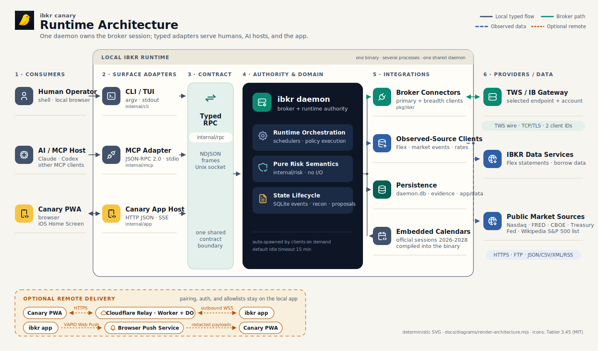
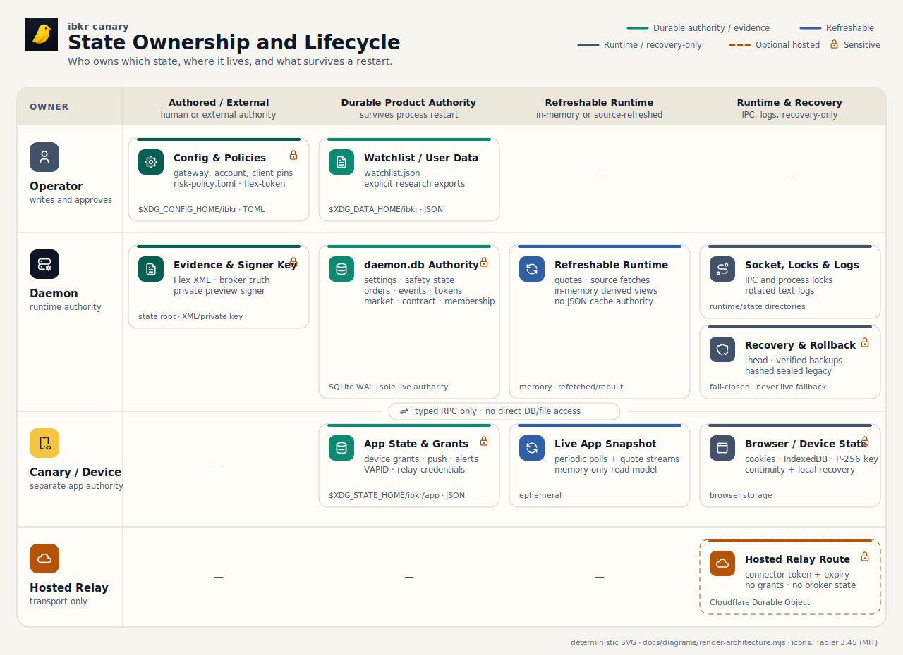

# Architecture

`ibkr` runs on your machine and connects to one Interactive Brokers TWS or IB
Gateway session. It adapts that session for humans, AI hosts, and the Canary
app, and it adds a risk harness. One ownership rule shapes the design:

> The daemon owns all broker-connected and runtime-state capability: the
> connection, observed state, schedulers, durable authority, and policy execution.
> Every other process adapts typed contracts for its audience, and none of
> them owns broker state.

A few local workflows are deliberate exceptions: watchlist edits, setup,
updates, process management, and offline research or backtests all run
without daemon RPC.

## System Overview

[PNG fallback](diagrams/system-architecture.png) ·
[SVG source generator](diagrams/render-architecture.mjs) ·
[Tabler Icons license](diagrams/ICON-LICENSE.txt)

The numbered columns are layers of one system, not six separate services:
consumers, surface adapters, the shared typed contract, daemon authority and
domain logic, integration clients, and external providers or data.

The default deployment has one shared daemon. `ibkr mcp` is an adapter process
owned by each MCP host, not a second daemon, and `ibkr app` is a separate
HTTP/PWA process. Inside the daemon, a primary broker connection serves
interactive, account, and gamma work, while a second client connection carries
the S&P 500 breadth history fan-out.

## Runtime Processes

All local modes ship in the same `ibkr` binary, but they differ in lifetime
and authority.

| Process or Surface | Lifetime | Responsibility |
|---|---|---|
| CLI / TUI | One command | Validates input, calls the daemon for broker and runtime work, and renders human or JSON output. A few local-only workflows run without the daemon. |
| `ibkr daemon` | Demand-driven background process or foreground service | Owns the broker connections and all runtime state: `daemon.db`, refreshable in-memory views, schedulers, source ingestion, risk-policy execution, proposals, opportunities, and reconciliation. |
| `ibkr mcp` | Long-lived child of each MCP host | Speaks MCP JSON-RPC 2.0 over stdio and translates tools and resources into short daemon calls. The surface serves read, research, and preview work; it exposes no broker-write tools. |
| `ibkr app` | Independently run or supervised HTTP process | Serves the embedded Canary PWA and owns pairing, auth, and app state. Maintains the live snapshot and quote streams, emits SSE, and can connect to the remote relay and Web Push. |
| Canary Paired PWA | Browser or iOS Home Screen app | Renders authenticated snapshots, receives SSE and push notifications, and keeps device-side credentials and recovery state. It is a plain PWA, not an Android Trusted Web Activity. |
| TWS / IB Gateway | Interactive Brokers process outside this repo | Terminates the local TWS API socket and maintains the broker-managed session. |

Clients auto-spawn the daemon when the socket is absent, and it exits after
15 idle minutes unless foreground mode disables the timeout. `daemon.db` and
the separately listed configuration, evidence, and app files survive;
refreshable in-memory views do not.

## Code Ownership Layers

- `pkg/ibkr` is the clean-room TWS wire client. Protocol framing, sockets and
  TLS, request IDs, broker callbacks, contract resolution, and order-wire
  details live here.
- `internal/daemon` is the long-running authority. It owns both broker
  connectors, the external-source clients, refreshable views, schedulers,
  `daemon.db`, risk-capital runtime state, daily Flex ingestion, and
  post-trade reconciliation.
- `internal/risk` is the pure evaluation library behind advisory verdicts:
  thresholds and fingerprints, canary signal types, option math, the daily
  trading rulebook, and risk-constitution evaluation. It does no I/O and owns
  no broker state.
- `internal/rpc` defines the typed method names and request/response structs
  that daemon, CLI, app, and MCP adapters share. Add fields here first; teach
  surfaces to render them second.
- `internal/cli` adapts commands to daemon methods or to one of the local-only
  workflows. Broker policy and state do not belong in the renderer.
- `internal/mcp` adapts MCP tools and resources to daemon contracts. Tool
  descriptions are product surface and must match the real authority and data
  quality.
- `internal/app` owns the HTTP host, device auth, app-local persistence, live
  polling and streaming, SSE fanout, Web Push, and the optional outbound
  relay. The live cache is the normal read path. Settings, reviews, and
  order, proposal, or opportunity actions make direct typed daemon calls
  instead.
- `cloudflare/remote-relay` is a Worker plus a Durable Object, used as
  transport. It forwards framed HTTP and SSE traffic over the app's outbound
  connector. It owns no device grants, pairing sessions, browser sessions,
  daemon access, or broker credentials.
- `web/app` is the embedded no-build Canary SPA and its service worker.
  Global account, market, and sync state stays outside individual tab
  content.

The desk-facing [Trading Policy](policies.md) reference explains who decides
each control, what is advisory today, how runtime-local version checks behave,
and which broker-write gates no policy may weaken.

## Data Flows and Protocols

The daemon protocol and the MCP protocol are different on purpose; only the
MCP side is JSON-RPC 2.0.

| Flow | Protocol and Payload | Notes |
|---|---|---|
| Human → CLI | `argv` / stdin; human text or JSON on stdout | One-shot local process. |
| AI host → `ibkr mcp` | MCP JSON-RPC 2.0, newline-delimited over stdio | The host owns the process lifetime. |
| CLI / MCP / app → daemon | Custom typed newline-delimited JSON request/response frames over a Unix domain socket | The envelope uses project fields such as `ok`, `frame`, `stream`, and `end`. It is not JSON-RPC 2.0. |
| App live service → daemon | Periodic typed calls plus long-lived quote streams | Feeds one app snapshot/cache and its change fanout. The source-neutral alert snapshot is ingested directly into the app's private inbox store and is excluded from the public live/SSE DTO. |
| App request routes → daemon | Request-driven typed calls over the same Unix socket | Used where a route needs a fresh action, review, or settings response instead of the cached snapshot. |
| Daemon → TWS / Gateway | Clean-room TWS wire protocol over TCP, optionally TLS | A primary interactive connection, plus a breadth connection with its own client ID and rate budget. |
| Browser / PWA ↔ app | Public static assets and pairing/auth endpoints, then authenticated HTTP(S) JSON and `/api/events` Server-Sent Events | Local and LAN access reaches the app directly. Pairing-session creation is loopback-only. |
| PWA ↔ remote relay | Public HTTPS carrying allowed HTTP/SSE traffic | Optional remote path. |
| App ↔ remote relay | HTTPS registration, then authenticated outbound WSS | Requests and streaming responses travel as frames over the WebSocket. The local connector enforces the forwarded-path allowlist. |
| App → browser push service → PWA | VAPID-authenticated Web Push over HTTPS | Push payloads are redacted, and the relay is not in the delivery path. |
| Daemon → external observed-data sources | Scheduled or on-demand HTTPS/FTP; JSON, CSV, XML, RSS, and text | Source health and stale or unknown states stay explicit in typed results. |

## Broker and External Data Sources

Not all market context arrives through TWS or Gateway.

| Source | Runtime Path | Data |
|---|---|---|
| TWS / IB Gateway API socket | TWS wire protocol over TCP/TLS | Account, positions, quotes, option chains/Greeks/OI, historical bars, scanners, order lifecycle, shortable-share observations, subscription-gated Wall Street Horizon earnings events, and broker WhatIf/eligibility. This includes an exact-contract historical `FEE_RATE` context fallback for currently held short stocks when the due FTP source is unusable; its scale is uncommissioned and policy-ineligible. |
| IBKR Flex Web Service | HTTPS POST and polling | Daily raw Flex XML statements used as broker statement truth for reconciliation. |
| IBKR short-stock availability | FTP | Primary global borrow availability and annualized fee-rate evidence; only current/session-valid rows can drive the extreme-fee flag. |
| Nasdaq | HTTPS JSON, pipe-delimited text, and RSS/XML | One independent earnings-date input, Reg SHO threshold securities, and LULD/trade-halt context. |
| FRED, CBOE, Federal Reserve, US Treasury | HTTPS CSV/XML | Public regime and rates series. |
| Wikipedia S&P 500 list | Scheduled HTTPS refresh | Breadth constituent membership, with a validated SQLite projection and embedded fallback. |
| Official exchange calendars | Embedded Go data | Handwritten build-time tables for US equities, US options, and Xetra, covering 2026 through 2028; a date outside coverage reports an explicit unknown state. There is no runtime calendar network call. |

Market-event, earnings-provider, contract-resolution, and membership
projections plus retained observations live in `daemon.db`. The primary FTP
borrow-fee state and the exact-contract TWS fallback use separate documents, so
a portfolio-only result can never replace the global last-good. TWS keys combine
an opaque account-scope fingerprint with the complete exact contract identity;
observations remain decision-ineligible while the scale is uncommissioned.
Persisted fallback attempts are dated context and never suppress a fresh
post-restart entitlement/data read. Earnings and FTP borrow-fee attempts retain
typed failure and retry state there so a restart cannot erase a failed source
read. Other refreshable views stay in memory or use disposable scratch only.

Reviewed terminal/non-reporting earnings evidence is also daemon-owned typed
state. An optional private `[rulebook].terminal_evidence_file` is read only at
startup as a validated import/update; rule snapshots serve the committed
exact-contract SQLite revision and never fall back to the file or ticker text.
Explicit removal retains a per-ConID revocation watermark in that SQLite
document; reactivation requires record verification strictly later than the
watermark, so bumping only the import wrapper cannot resurrect old evidence.
Every initialize/import/update/revoke revision atomically appends a typed,
prose-free authority-change observation with the old/new catalog fingerprints,
review times, and per-contract dispositions. Rule-transition event payloads
link any accepted terminal classification back to that chain with the exact
contract ConID, authority revision and record fingerprint, review and validity
times, and classification. They emit an explicit empty linkage list otherwise
and exclude issuer/symbol text, CIK, source URLs, and evidence prose.

## Data and Persistence

[PNG fallback](diagrams/data-and-persistence.png) ·
[SVG source generator](diagrams/render-architecture.mjs) ·
[Tabler Icons license](diagrams/ICON-LICENSE.txt)

Configuration is operator-owned, and daemon state and app state are separate
authorities. `daemon.db` is the daemon's sole live authority for mutable state,
append-only events, orders, and retained market observations. Retained Flex XML
remains original broker evidence; the daemon transactionally refreshes its
typed statement inventory and equity projection in `daemon.db` from the
complete XML set. See [Storage](database.md) for why the daemon uses SQLite,
the physical data relationships, truth boundaries, supported query paths, and
current recovery limits.

| Class | Default Location | Owner and Representative Contents |
|---|---|---|
| Operator configuration | `$XDG_CONFIG_HOME/ibkr/config.toml`, falling back to `~/.config/ibkr/config.toml`; policy defaults under `~/.config/ibkr/policies/` | Gateway/account/client pins, daemon/trading settings, protection/opportunity policy, the operator-authored `risk-policy.toml`, the optional private terminal-evidence import path, and the separate `flex-token` secret. The risk policy has no embedded default: missing approval stays unapproved. |
| Daemon durable authority | `$XDG_STATE_HOME/ibkr/daemon.db` (SQLite, WAL), falling back to `~/.local/state/ibkr/daemon.db` | Sole live daemon authority for platform settings, risk-capital and governance state, the last-good Regime publication and projection receipt, source-neutral alert episodes, trading readiness, purge state, orders and token tombstones, proposals and opportunities, decision/event history, retained observations, and statement projections. It is not delete-safe and never falls back to legacy files. |
| Original broker evidence | `$XDG_STATE_HOME/ibkr/statements/flex-*.xml` | Immutable retained Flex statements. SQLite stores a complete current inventory, immutable file/equity versions, and current per-day winners derived transactionally from this set; it does not replace the XML evidence claim. |
| Recovery artifacts | `$XDG_STATE_HOME/ibkr/backups/`, `$XDG_STATE_HOME/ibkr/legacy-sealed/<cutover-id>/`, and `$XDG_STATE_HOME/ibkr/daemon.db.head` | Verified database backups, hashed pre-cutover artifacts, and the external monotonic-head watermark. They are recovery and anti-rollback material only, never normal read fallbacks or dual-write targets. |
| Private signer key | `$XDG_STATE_HOME/ibkr/order-preview-key-v2` | Private token-signing material bound to the current authority generation. It is deliberately outside ordinary database state. |
| App durable state | `$XDG_STATE_HOME/ibkr/app`, falling back to `~/.local/state/ibkr/app` | Private `state.json` with device grants, push subscriptions, VAPID material, the source-neutral alert inbox, unread cursor, delivery attempts and receipts, delivery health, and relay credentials; `app.lock` enforces one app process per state directory. |
| Disposable scratch | `$XDG_CACHE_HOME/ibkr`, falling back to `~/.cache/ibkr` | Updater and transport scratch only; it is never daemon business-state authority. Contract, membership, regime, breadth, gamma, and decision data are SQLite projections/observations or refreshable in-memory views, not live files here. |
| User data | `$XDG_DATA_HOME/ibkr`, falling back to `~/.local/share/ibkr` | `watchlist.json`; explicit research exports are separate operator-created files. |
| Runtime IPC and logs | `$XDG_RUNTIME_DIR/ibkr/ibkr.sock`, falling back to `~/.cache/ibkr/ibkr.sock`; daemon log defaults to `~/.local/state/ibkr/ibkr-daemon.log` | Unix socket, sibling lock/PID file, rotated daemon text log, and optional macOS LaunchAgent/app logs under `~/Library`. |
| Browser / PWA state | Browser cookie jar, IndexedDB, and `localStorage` | Short-lived session, durable HttpOnly device continuity, P-256 device key, local recovery material, preferences, and a non-authorizing relay route identifier. |
| Hosted relay state | Cloudflare Durable Object | Connector token and expiry for the optional route. It stores no device grants or broker state. |

The four history commands — `ibkr regime history`, `ibkr rules history`,
`ibkr canary history`, and `ibkr recon equity` — query `daemon.db` through
typed daemon RPC; MCP and the app currently expose no history surface. Order
reads use the same database authority. There is no `history.db` ingest path,
journal scan fallback, rotation job, or dual write after cutover. The legacy
decision histories deliberately start empty. Imported historic market and
gamma measurements are immutable observations stamped
`decision_eligible=false` in a typed, non-null column (and provenance
metadata); they support research but never seed current
state or a current verdict, with one narrow cutover repair: when gamma has no
current last-good document, the daemon may strictly validate the newest
quarantined legacy gamma observation and promote a copy to the gamma state
slot with `authority_provenance=recovered_legacy_observation`. The immutable
observation remains byte-exact and decision-ineligible, and the promoted copy
is context-only until a fresh current-code compute replaces it. Current state
always wins; this is not a generic history fallback or a revival of file
authority.

Cutover preserves safety-critical settings, capital/governance continuity,
active or uncertain order chains, consumed-token tombstones, conservative
order-ID floors, and purge rows and fill cursors. Trading readiness resets;
current regime state and regime/rules/canary/proposal/opportunity decision
history start clean, as do brief comparison baselines and proposal/opportunity
snapshots.

The daemon writes and fsyncs `daemon.db.head` before publishing the initial
database and after every committed mutation. An existing database without
that watermark fails closed and requires explicit verified recovery. The
runtime verifies the actual application schema objects and recomputes stored
content hashes for safety state and append-only evidence; it does not trust the
migration ledger or SQLite's structural check alone. It does not automatically
repair corruption or restore a backup; recovery and broker/order reconciliation
are a separate operational procedure.

Schema readiness is part of daemon startup, before state adapters attach, the
RPC socket is served, or either broker connection starts. A fresh installation
creates and validates `daemon.db` directly at the binary's target schema. For
an existing database, the daemon compares the on-disk schema version and
checksummed migration ledger with that target: an equal version proceeds only
after normal validation, a newer version refuses downgrade, and an older
version enters the automatic upgrade coordinator.

An upgrade never mutates the published database in place. Under the persistence
lock, the coordinator first creates a verified, standalone backup at the exact
current authority head, then applies immutable, ordered migrations to an
unpublished candidate and runs the full schema, integrity, foreign-key,
content-hash, and authority checks. A successful upgrade preserves the
authority epoch and evidence, advances the authority head once, and atomically
publishes the validated candidate. A small fsynced recovery manifest records
the durable upgrade phase so restart can resume deterministically across the
watermark and publication boundary; it is transient coordination, not another
business-state authority. The pre-upgrade backup remains recovery-only, and a
failed or ambiguous upgrade never triggers automatic repair or restore.

SQL schema versions govern tables, indexes, constraints, and triggers. Mutable
JSON documents carry independent, kind-specific payload versions and typed
migrations. Append-only events are not rewritten to fit a new shape; new event
or payload versions retain compatible readers or feed a new projection.

Never persist broker market-data entitlements. Expose observed data type,
quality, freshness, and warnings on typed read surfaces instead.

The current Regime result is one immutable, daemon-owned last-good document.
Its typed authority health distinguishes fresh, stale, refreshing, and cold
unavailable state. Streak, rule-stage, and decision-event projections bind to
the exact publication revision, commit time, and semantic fingerprint; a
separate receipt makes the single-revision crash window replayable before the
RPC socket or a later publication is allowed. An unreceipted revision is
withheld atomically from Regime consumers. A clock behind the retained commit
is explicit `clock_invalid` stale context and cannot publish a refresh or
relax the rulebook until it catches up.

Regime source quality is not a weak form of market stress. Missing, broken,
contradictory, or cadence-overdue required evidence produces the explicit
`data_quality` lifecycle and “Market state undefined — data incomplete.” Only
exact producer-authored `not_due` schedules remain context. Independently
current confirmed stress may survive an unrelated source defect with degraded
readiness, but every confirming row, source-health record, and direct tape
witness must itself be current.

The daemon's alert registry is source-neutral and durable. It owns opaque
account/mode-scoped episode and occurrence identity, producer lifecycle, and
typed source coverage. The app keeps the separate private delivery authority:
one inbox, unread cursor, per-target attempt and receipt ledger, delivery
health projection, and serialized dispatcher for every alert source.

The first complete, current snapshot in each authority scope establishes a
cutover baseline. Conditions already active at that boundary remain visible
but cannot create a backlog push. Later delivery requires a current candidate,
current and covered evidence from that exact source, an allowed app notification
mode, an active target, and no prior accepted receipt. The dispatcher durably
reserves and rechecks each occurrence-and-target attempt before Web Push, maps
the daemon's closed presentation code to fixed app-owned copy, and records
acceptance, retry, rejection, or uncertain interruption. Scope changes create
only bounded generic previous context; they are not recovery, clear, unread,
or delivery events. See
[Alerts and Regime production contract](design/alert-regime-production.md).

## Deployment Scopes and Multiple Instances

The default topology is one daemon shared by the CLI, all local MCP adapter
processes, and the app, through the canonical Unix socket. A flock-backed
lock enforces one daemon per socket directory.

You can run more daemon, gateway, or account scopes, but nothing multiplexes
them for you. An isolated stack needs its own config, socket, log, account
and client pins, and its own XDG state, cache, and data roots. Most durable
paths are XDG-global rather than derived from the socket, so changing only
`IBKR_SOCKET` does not isolate persistence.

## HTTP App and Remote Access

The app is the only HTTP process; it serves through HyperServe
(`github.com/osauer/hyperserve`), the project's companion `net/http`-shaped
server, with method-aware routes, hardened defaults, and SSE formatting. The
daemon and the MCP adapter do not serve HTTP at all: the daemon listens on
the Unix socket, and MCP speaks stdio.

Routes register in `internal/app/http/routes.go` in four families: static
PWA assets, pairing and auth, the authenticated app API, and the
`/api/events` SSE stream. Handlers read app stores, the live snapshot, or
typed daemon calls; they do not invent policy. There is no separate health
route; `/api/bootstrap` and `/api/snapshot` carry relay and liveness state.

Remote access keeps pairing, auth, session validation, forwarding allowlists,
and daemon access on the local machine. The Worker and the Durable Object
carry route transport state only. Browser HTTP and SSE requests travel as
frames over the app's authenticated outbound WebSocket and stream back
through the Worker.

## Observability

The observability layer is thin on purpose: text logs, one health surface,
typed database evidence, and bounded alert lifecycle and delivery counters. There
is no external metrics stack and no tracing.

- The daemon writes structured text logs through `log/slog`. The `log_level`
  config key sets the level; the default is `info`. The log lives at
  `~/.local/state/ibkr/ibkr-daemon.log` and rotates at boot once it passes
  64 MiB, keeping one older generation. The app logs to `ibkr-app.log`.
- `ibkr status` renders the daemon's `status.health` report: gateway,
  session, and TLS state, uptime, background tasks, subsystem health, data
  quality, data-farm notices, and trading state. It ends in one verdict:
  ready, attention, offline, or starting.
- Typed read surfaces carry their own source health. Regime clusters, gamma,
  the market calendar, and governance report stale, partial, degraded, or
  unknown instead of guessing.
- Append-only SQLite events are the evidence trail for orders, regime, rule,
  and canary decisions, proposal outcomes, capital events, and risk-policy
  governance. Mutable documents use compare-and-swap revisions, while coupled
  state/event changes share one transaction. `ibkr brief` and the CLI history
  commands compose or query this typed daemon authority directly.

## Change Flow

Start every new capability with an ownership decision: operator config,
daemon database state/event/observation, app-local state, non-authoritative
cache, original external evidence, or build flag. Then work outward in order: typed contract, owning behavior, tests,
adapters, rendered surfaces, and generated references. Adapters never refetch
daemon-owned sources and never recreate risk or trading verdicts.

Market-event flags are daemon-owned observed context. Adapters render or
filter the typed `market_events.snapshot`; they do not refetch Reg SHO, halt,
borrow-inventory, borrow-fee, or earnings sources, and they do not duplicate
proposal-blocking policy. The daemon also owns the `borrow_fee_coverage`
projection: FTP is global authority, while historical `FEE_RATE` is bounded by
the atomic portfolio rows/receipt, exact ConID and route, and a same-scope check
before persistence. Restart discards runtime entitlement, failure, and backoff
state; only an exact identical-wire 15-second retry boundary survives so a
bounce cannot duplicate the same broker request immediately.

For operator and builder reference, use [Sensors](sensors.md) for measurement,
freshness, last-good, and dependency semantics; [Trading Policy](policies.md)
for the human decision and system-control model; and [Storage](database.md) for
state, evidence, SQLite relationships, query boundaries, durability, and
recovery. These pages are generated to public HTML from their Markdown sources
by the same deterministic chain as this page.
