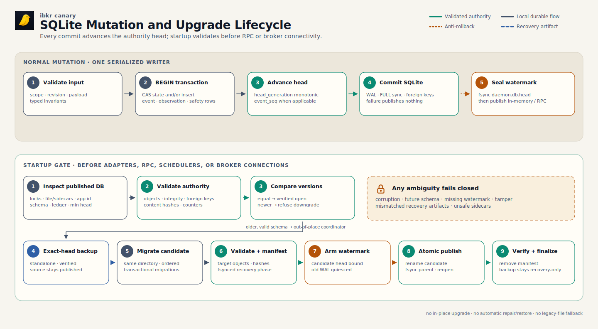

# Database

`daemon.db` is the daemon's embedded SQLite authority. It stores mutable
runtime state, append-only events, order-safety continuity, retained
observations, and broker-statement projections without introducing a database
service or a second writer.

> The daemon is the only live database writer. Product surfaces query typed
> daemon contracts; operator policy remains in TOML, original Flex XML remains
> broker evidence, and backups are recovery artifacts rather than read replicas.

## Logical Data Model

[PNG fallback](diagrams/sqlite-data-model.png) ·
[SVG source generator](diagrams/render-architecture.mjs) ·
[Tabler Icons license](diagrams/ICON-LICENSE.txt)

The diagram is a logical ER view of schema version 1. It shows the durable
relationships that matter to readers while grouping similar event projections.
The canonical DDL remains `internal/daemon/corestore/schema.go`; migrations,
not this picture, define the exact columns, constraints, indexes, and triggers.

## Authority Boundary

| Data class | Live authority | Access rule |
|---|---|---|
| Daemon state, events, order continuity, retained observations, and statement projections | `$XDG_STATE_HOME/ibkr/daemon.db`, normally `~/.local/state/ibkr/daemon.db` | Daemon owns writes. CLI, MCP, app, and dashboards use typed daemon RPC. |
| Operator configuration and policy | `config.toml` and `policies/*.toml` | Authored outside SQLite. The database may retain applied state, fingerprints, and audit events but never becomes the policy-editing surface. |
| Original broker statement evidence | `$XDG_STATE_HOME/ibkr/statements/flex-*.xml` | Immutable external evidence. SQLite stores a complete inventory, immutable versions, and current derived day winners. |
| Preview signer and Flex token | Private files in config/state roots | Secrets are deliberately outside ordinary database rows. |
| App grants, push subscriptions, inbox, and relay credentials | App-owned state directory | Separate authority. The app never opens `daemon.db`. |
| `daemon.db.head`, verified backups, and sealed legacy files | State-root recovery directories | Anti-rollback or recovery only. Never a fallback business-state reader. |

Changing only `IBKR_SOCKET` does not isolate persistence. Each isolated daemon
stack needs distinct config, socket, account/client pins, and XDG state roots.
A persistence lock beside the database prevents alternate sockets from writing
one authority concurrently.

## Table Families

### Store and mutable state

| Table | Grain and purpose |
|---|---|
| `schema_migrations` | One immutable row per applied SQL migration: version, name, checksum, and application time. `PRAGMA user_version` must agree with it. |
| `store_meta` | Singleton authority identity and monotonic counters: epoch, head generation, event sequence, signer generation, and timestamps. SQL triggers prevent deletion, epoch replacement, or counter rollback. |
| `legacy_imports` | One recorded import result per scope/source kind. It proves what the clean cutover imported or skipped; it is not a live fallback. |
| `state_documents` | One current JSON document per `(scope_key, kind)`, with compare-and-swap revision, SHA-256, and update time. Payload shape is owned by the document kind and its typed version. |

`state_documents` holds current versions of settings, risk-capital state,
trading readiness, purge state, proposal/opportunity snapshots, Regime and
gamma last-good state, membership/contract caches, alert episodes, and other
daemon-owned documents. Consumers must not treat the JSON column as one global
schema: always select by kind, validate the kind-specific payload version, and
use the owning typed reader.

### Event spine and typed projections

`event_log` is the append-only event spine. Each event has a scope, unique
event key, type, action, origin, occurrence and record times, a JSON payload,
and a stored payload digest. Domain tables share the same `event_seq` primary
key and project the fields needed for bounded, indexed reads:

| Projection | Purpose |
|---|---|
| `regime_decisions` → `regime_indicators` | Market-regime decision header and zero-or-more per-indicator rows. Indicators reference their owning regime decision. |
| `rule_transitions` | Rule ID, current/previous status, and policy identity. |
| `canary_transitions` | Portfolio action, severity/direction, market stage, input health, and alert relevance. |
| `capital_events` | Capital flow, reconciliation, reset, and related risk-capital event fields. |
| `risk_policy_events` | Policy lifecycle/governance event identity and fingerprint. |
| `proposal_outcomes` | Proposal state transitions keyed by proposal identity and revision. |
| `order_events` | Order lifecycle details tied to a broker scope, including safe local/broker/token identifiers. |

Projection rows do not replace the immutable event payload. New query shapes
should add a typed projection or version-aware reader rather than rewrite old
events to look current.

### Broker scope and order safety

`broker_scopes` binds endpoint, client ID, account, and mode into one immutable
scope identity. `order_events` and `consumed_preview_tokens` reference that
scope, so equal order IDs or references on different routes cannot alias.

`consumed_preview_tokens` is a unique tombstone table. Token consumption,
order-ID floor advancement, and the durable pre-transmit order event commit in
one transaction before broker transmission. `order_id_floors` stores global or
broker-scoped lower bounds; a trigger forbids decreases. A failed critical
transaction blocks the broker send rather than falling back to an unjournaled
path.

### Observations

`observations` retains source payloads with source, kind, observed/recorded
times, content type, payload digest, optional metadata JSON, and a non-null
`decision_eligible` flag. Current code can couple eligible observations to a
state revision in one transaction. Imported legacy market/gamma payloads are
immutable research evidence with `decision_eligible=false`; generic history
must never seed a current verdict or last-good state.

An analytics reader must preserve source, method/version, as-of, quality,
eligibility, and provenance. A row existing in this table does not mean it was
eligible for a live decision.

### Broker statements

The statement family separates mutable current inventory from immutable
restatement evidence:

| Table | Role |
|---|---|
| `statement_files` | Current complete inventory, one row per `(scope_key, file_key)` and current SHA-256. |
| `statement_file_versions` | Immutable versions of each retained XML file, keyed by scope, file key, and content hash. |
| `statement_equity_days` | Current winner for one account/day, derived from the complete current inventory. |
| `statement_equity_day_versions` | Immutable derived versions tied by foreign key to the exact statement-file version. |

The daemon parses the complete retained XML set and replaces the current file
inventory and daily winners transactionally. A parse/read failure leaves the
previous complete projection intact. Same-name/same-size restatements are
detected by content hash; removed files retract only their current winners,
while immutable versions retain what was previously observed.

## Indexes and Immutability

Time-ordered indexes support event, observation, order, and statement-history
reads without turning table order into semantics. Partial indexes accelerate
order lookup by reference, reserved ID, permanent ID, and preview token only
when those fields exist.

SQL triggers reject update and delete on the migration ledger, broker scopes,
event/evidence tables, event projections, token tombstones, and immutable
statement versions. Mutable current tables use explicit replace/CAS semantics.
Startup validates the exact table/index/trigger manifest; a migration ledger
alone is not proof that the schema is trustworthy.

## Mutation and Upgrade Lifecycle

[PNG fallback](diagrams/sqlite-update-lifecycle.png) ·
[SVG source generator](diagrams/render-architecture.mjs) ·
[Tabler Icons license](diagrams/ICON-LICENSE.txt)

### Normal writes

The store uses WAL, foreign keys, `synchronous=FULL`, supported full-fsync,
a bounded busy timeout, and one serialized database connection. Each committed
mutation advances `store_meta.head_generation`; event transactions also
advance the event sequence. The daemon then fsyncs the external
`daemon.db.head` watermark. If that post-commit observer fails, the SQLite
transaction is already durable, but the store returns an error, latches
unhealthy, and does not publish the corresponding in-memory/RPC success.
Critical persistence failure is typed health and a trading blocker, not
permission to write a legacy file or fall back to another authority.

State writers use compare-and-swap revisions. Several store APIs atomically
couple a state document with event or observation rows, which prevents the
current view and its durable evidence from describing different decisions.
Append-only producers insert once; statement ingestion publishes a whole
inventory/projection transaction; order staging binds its safety rows before
transmit.

### Startup validation

Database readiness completes before state adapters attach, RPC serves, a
scheduler runs, or a broker connection starts. The daemon verifies:

- application ID, schema version, and the checksummed contiguous migration
  ledger;
- the canonical tables, indexes, constraints, and triggers;
- SQLite integrity and foreign keys;
- stored SHA-256 values for state documents and append-only evidence;
- authority epoch, monotonic counters, and the external minimum head;
- private file modes, regular-file/directory types, and the expected
  WAL/sidecar state.

An equal supported version opens only after validation. A newer database
refuses downgrade. An older valid database enters the out-of-place upgrade
coordinator. Corruption, missing watermark, tampered schema/content, ambiguous
recovery state, or future version fails closed; the daemon does not delete,
recreate, repair, or automatically restore the authority.

### Out-of-place schema upgrade

1. Inspect and validate the published source at its exact authority head.
2. Create and reopen a standalone immutable pre-upgrade backup at that head.
3. Copy to an unpublished same-directory candidate and apply ordered,
   checksummed migrations transactionally.
4. Fully validate the candidate and advance the authority head exactly once
   for the schema transition.
5. Fsync a recovery manifest binding the source, backup, candidate, versions,
   fingerprints, heads, and durable phase.
6. Advance the anti-rollback watermark, quiesce the old WAL, atomically publish
   the candidate, fsync the directory, reopen, and verify.
7. Durably remove the transient manifest. The verified backup remains
   recovery-only.

Restart resumes from the manifest's last verified phase. Any mismatched or
missing artifact fails closed instead of guessing from filenames or modification
times. Recovery and backup restore remain an explicit offline operator
procedure because signer generation, broker-open orders, and conservative
order-ID floors must be reconciled before writes resume.

## Three Independent Version Domains

Do not use one version number as a proxy for another:

1. **SQL schema migrations** change tables, indexes, constraints, and triggers.
2. **State-document payload versions** change one `(scope, kind)` JSON shape and
   use a typed migration/validator owned by that document.
3. **Append-only event or observation payload versions** retain immutable rows
   and evolve through compatible readers or new projections.

Policy versions and semantic fingerprints are a fourth business domain. They
may be stored in events and projections, but changing policy does not imply a
SQL migration.

## Query and Analytics Contract

The supported access path depends on the question:

| Question | Supported path | Why |
|---|---|---|
| Current operator or dashboard state | Add/use a typed daemon RPC in `internal/rpc` with a daemon-owned query. | Preserves authority, scope, freshness, access control, and forward compatibility. |
| Existing decision history | `ibkr regime history`, `ibkr rules history`, `ibkr canary history`, and `ibkr recon equity`, all through typed daemon RPC. | Uses the intended indexed projections and preserves result semantics. |
| Orders | `ibkr orders open`, `ibkr orders history`, and `ibkr order status`. | The local journal is lifecycle evidence, not a broker Activity Statement. |
| Research over retained observations | A bounded, typed eligible-only or explicitly research-only daemon query. | Forces callers to preserve `decision_eligible`, provenance, quality, and scope. |
| Offline forensic SQL | A separately verified, consistent backup under an explicit offline procedure. | Opening or copying the live main file can miss WAL state; recovery artifacts are not normal dashboard replicas. |

There is no supported general-purpose read replica or direct-SQL dashboard API.
Do not point Grafana, notebooks, an ORM, or a second process at the live
`daemon.db`, and never write it outside the daemon. A new analytics feature
should define:

- the authoritative grain and scope key;
- current state versus event history versus observation evidence;
- time basis (`occurred_at`, `observed_at`, `recorded_at`, or update time);
- eligibility, provenance, freshness, and finality;
- bounded filters, ordering, pagination, and redaction;
- the typed RPC result and the projection/index that makes it efficient;
- behavior for missing, stale, partial, future-clock, or corrupt evidence.

Avoid `SELECT *` as a contract, row counts as proof of coverage, and JSON field
extraction without a kind/version guard. Never join across `scope_key` values
unless the product contract explicitly defines cross-scope aggregation.

## Reference Map

- [Architecture](architecture.md): process, persistence, and authority
  ownership.
- [Daemon SQLite Authority](design/daemon-sqlite-authority.md): cutover,
  recovery, durability, and threat-model decision record.
- `internal/daemon/corestore/schema.go`: canonical DDL and immutable migration
  plan.
- `internal/daemon/corestore`: store transactions, events, observations,
  statements, backup, validation, and upgrade implementation.
- [Policies](policies.md): why policy authoring stays outside the database even
  though applied state and audit evidence live inside it.
