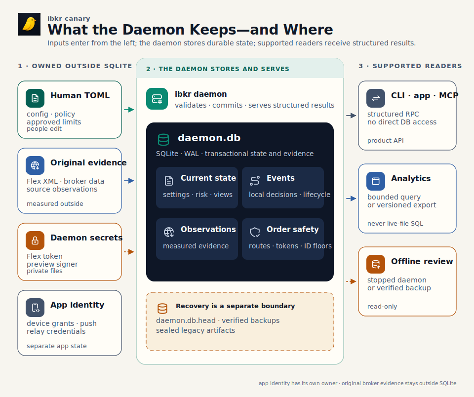
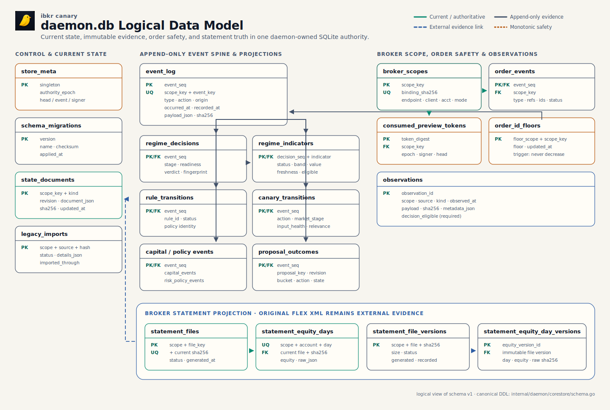

# Storage: State, Evidence, and Recovery

When `ibkr` restarts, it must pick up the same account context with the same
safety history. The daemon needs to remember which state was current, which
evidence supported a decision, which preview tokens were consumed, how far
broker order IDs advanced, and which broker statements were incorporated.

That job belongs to the daemon's storage layer. It uses a local SQLite file
named `daemon.db`, accessed through a pure-Go driver inside the `ibkr` binary.
SQLite supplies the storage engine; the surrounding code defines what may be
stored, who may write it, and how it becomes safe to use.

> One daemon writes durable runtime state. Product surfaces read it through
> typed daemon APIs. Human-authored policy and original broker evidence keep
> their own sources of record.

This reference starts with that operating model, then works down through the
tables, read and write paths, recovery mechanics, and current limits.

## Storage Layer in One View

[PNG fallback](diagrams/storage-overview.png) ·
[SVG source generator](diagrams/render-architecture.mjs) ·
[Tabler Icons license](diagrams/ICON-LICENSE.txt)

Inputs with their own owners enter from the left. The daemon validates them,
combines them with live observations, and commits the resulting state and
evidence to `daemon.db`. CLI, app, and MCP surfaces receive structured results
on the right. Analytics use bounded daemon queries or versioned exports, while
offline inspection uses a stopped daemon or a verified backup.

This boundary keeps the meaning of a row with the code that created it. It also
gives broker-critical writes one ordered path instead of several competing
writers.

## Why SQLite Fits This Desk

The current deployment has one application writer on one machine. SQLite fits
that shape well: it ships with the binary, commits related facts atomically,
and provides indexed reads without another service to operate.

| Requirement | What SQLite provides | Operating boundary |
|---|---|---|
| One daemon owns writes | A local file with no database server, port, credentials, or administrator | Several writers or hosts require a different topology. |
| Related facts change together | Transactions can commit state, evidence, token tombstones, order floors, and lifecycle events as one unit. | Every writer goes through the daemon's typed transaction APIs. |
| History needs structured reads | Tables and indexes support bounded state, event, order, observation, and statement queries. | Some current history readers still scan event JSON and need to move onto those indexes. |
| Installation stays local | The pure-Go driver embeds the engine in the `ibkr` binary. | High availability and centralized concurrent analytics sit outside this deployment model. |
| Schema changes preserve recoverability | The daemon can upgrade a verified copy and publish it only after validation. | Routine backup, retention, and restore operations still need an operator workflow. |

SQLite remains appropriate while each daemon/account stack has one writer.
Multi-host writes, automatic failover, or many concurrent analytical readers
would justify a new topology. Giving those readers the live file would bypass
the ownership and recovery rules that make the current design safe.

## What the Daemon Remembers

`daemon.db` carries five kinds of continuity:

- **Current daemon state:** settings, risk-capital state, readiness, purge
  state, current proposals and opportunities, alert episodes, and last-good
  market or model publications.
- **Local decision history:** events explaining what the software observed,
  evaluated, or attempted. Broker confirmations and statements establish
  execution separately.
- **Measured evidence:** market, gamma, membership, contract, and other source
  observations with time, provenance, and decision-eligibility metadata.
- **Order safety:** exact broker-route bindings, consumed preview tokens,
  conservative order-ID floors, and pre-transmit order events.
- **Statement-derived views:** file inventory and daily equity views rebuilt
  from the complete retained set of original Flex XML statements.

Several records stay beside the database because they have different owners or
recovery lifecycles:

| Record | Owning location | Role |
|---|---|---|
| Human intent and approved limits | `config.toml` and `policies/*.toml` | People author these declarations; SQLite retains applied identities and resulting events. |
| Original broker statements | `$XDG_STATE_HOME/ibkr/statements/flex-*.xml` | The retained XML is the broker-supplied evidence behind SQLite's inventory and derived daily views. |
| Preview signer and Flex credentials | Private config and state files | Secrets and signing material rotate independently from ordinary database rows. |
| Device grants, push subscriptions, and relay credentials | App-owned state directory | The app has separate authentication duties and never opens `daemon.db`. |
| Recovery material | `daemon.db.head`, verified backups, and sealed legacy artifacts | These detect rollback or support offline recovery; normal product reads use the published database. |

An isolated second daemon needs its own config, socket, broker/account/client
pins, and XDG state roots. Changing only `IBKR_SOCKET` leaves storage shared. A
lock beside `daemon.db` prevents alternate socket paths from writing the same
file concurrently.

## Five Questions Behind the Data Model

The schema follows the questions the product must answer:

| Product question | Storage structure | Meaning of one row |
|---|---|---|
| What is true now? | `state_documents`, `statement_files`, `statement_equity_days` | The latest accepted revision or selected statement-derived record for one scope and kind. |
| What did the software observe or decide? | `event_log` | One immutable local lifecycle event with its original JSON payload and digest. |
| What was measured? | `observations` | One retained source measurement, including observation time and decision eligibility. |
| What must never be reused or move backwards? | `broker_scopes`, `consumed_preview_tokens`, `order_id_floors`, `order_events` | Route identity, a spent capability, a conservative ID floor, or an order-lifecycle fact. |
| What did the broker originally report? | Retained Flex XML plus four statement tables | SQLite records exact file versions and current or historical daily-equity projections. |

The schema uses relational columns for safety-critical identities and
irreversible facts. Keys, foreign keys, constraints, indexes, and triggers make
those rules visible to SQLite. Varied current snapshots remain versioned JSON
documents, and immutable events retain their original payloads. Frequently
queried event fields may also appear in relational projection tables.

Those projections are only partly earning their complexity today. The main
Regime, rules, Canary, and capital-history readers still load matching
`event_log` JSON and filter it in Go. The projections should become the bounded,
indexed read path or leave the schema when compatibility permits.

## Physical Data Model

[PNG fallback](diagrams/sqlite-data-model.png) ·
[SVG source generator](diagrams/render-architecture.mjs) ·
[Canonical DDL](https://github.com/osauer/ibkr/blob/main/internal/daemon/corestore/schema.go)

The diagram shows schema version 1. Solid lines are declared SQLite foreign
keys. Dashed lines describe relationships enforced by Go code. A shared name
such as `scope_key` creates a namespace only when no foreign key joins it.

| Parent | Child | Cardinality |
|---|---|---|
| `event_log` | Each event projection: `regime_decisions`, `rule_transitions`, `canary_transitions`, `capital_events`, `risk_policy_events`, `proposal_outcomes`, and `order_events` | One event to zero or one row in each individual child table. |
| `regime_decisions` | `regime_indicators` | One decision to zero or more indicators. |
| `broker_scopes` | `consumed_preview_tokens` | One broker route to zero or more consumed tokens. |
| `broker_scopes` | `order_events` | One broker route to zero or more order events. |
| `statement_files` | `statement_equity_days` | One current statement-file identity to zero or more current daily-equity rows. |
| `statement_file_versions` | `statement_equity_day_versions` | One immutable file version to zero or more immutable daily-equity versions. |

Six tables stand alone: `store_meta`, `schema_migrations`, `legacy_imports`,
`state_documents`, `observations`, and `order_id_floors`. Other useful
relationships also remain application conventions:

- state and an event or observation may commit together without storing a
  lineage key between their rows;
- Go writers select at most one event-projection family per event, while SQL
  permits several projection rows with the same `event_seq`;
- current statement rows and immutable statement versions are written together
  without a foreign key joining the two families;
- validated broker-scope values associate order-ID floors with a route.

The canonical columns, constraints, indexes, and triggers live in
`internal/daemon/corestore/schema.go`. The renderer compares its complete table
and foreign-key inventory with that file, so schema drift fails the diagram
gate. Readers of JSON documents, events, and observations still need the
expected kind and payload version, plus scope, time basis, provenance,
eligibility, and data quality.

## Writing and Reading Data

### Commit a state change

Publishing a market observation follows one ordered path:

1. Validate scope, payload, source metadata, and the expected current revision.
2. Update the current `state_documents` row and append the immutable
   `observations` row in one SQLite transaction.
3. Advance the committed-write counter and commit under WAL with foreign keys
   and full synchronization enabled.
4. Update and fsync `daemon.db.head`, the external record of the newest accepted
   counter, before publishing the new in-memory and RPC view.

A failure in step 4 happens after the SQLite commit. The store reports the
failure, marks itself unhealthy, and withholds the new in-memory/RPC view. State
and observation remain transactionally aligned, although the current schema
stores no direct observation ID on the state row.

### Protect a broker transmission

Before sending an order, one transaction binds the exact broker route, records
the consumed preview token, advances the conservative order-ID floor, and
appends the pre-transmit event. A failed transaction stops the send. Policy,
dashboards, and alternate files cannot replace this durable safety evidence.

### Read current and historical data

| Question | Supported path | Present limitation |
|---|---|---|
| Current product or dashboard state | Typed daemon RPC and a daemon-owned reader | A new dashboard needs a defined contract before it gets a query. |
| Regime, rules, Canary, or capital history | Existing CLI commands over typed daemon RPC | Most paths still scan canonical event JSON instead of indexed projections. |
| Orders | `ibkr orders open`, `ibkr orders history`, and `ibkr order status` | Local lifecycle records explain intent and evidence; the broker Activity Statement remains execution truth. |
| Statement-derived equity | Typed reconciliation and equity readers | The current reader has a fixed result ceiling rather than a general paginated API. |
| Retained observations | Narrow daemon-owned readers for their product purpose | General research access awaits a corrected time-and-ID pagination cursor. |
| Offline forensic SQL | Stop the daemon and open `daemon.db` read-only, or inspect a verified consistent backup | SQL shapes are implementation details and may change with the binary. |

A running WAL database may contain committed changes outside the main file.
Copying `daemon.db` alone can therefore produce an inconsistent artifact. Keep
`sqlite3`, Grafana, notebooks, ORMs, and other services away from the live file.

For a new dashboard or analysis, define scope, row meaning, time basis,
freshness, eligibility, ordering, pagination, and redaction first. Then add a
bounded daemon query or typed export backed by a suitable index or projection.

## Durability and Recovery

### Normal operation

The store uses WAL, foreign keys, `synchronous=FULL`, supported full-fsync
controls, a bounded busy timeout, and one serialized connection. Serial access
keeps writer ordering simple. It also means an unbounded read can delay a
broker-critical write, so production reads need limits and indexes.

### Startup gate

Storage becomes ready before the daemon serves RPC, runs schedulers, or
connects to the broker. Startup checks private file types and modes, SQLite's
application ID and schema version, the checksummed migration ledger, the exact
table/index/trigger inventory, `quick_check`, foreign keys, the external minimum
write counter, and digests for selected payload columns.

This catches schema drift, structural damage, rollback, and selected payload
changes. Integrity coverage remains selective: event headers, observation
metadata and eligibility, typed projections, broker bindings, and current
statement winners do not yet share one canonical whole-record digest.

### Schema upgrades

The daemon upgrades an older valid schema through an unpublished copy. Under
the persistence lock it creates a verified backup, migrates a same-directory
candidate, validates the candidate, records recovery state, and atomically
publishes the result. A future schema refuses downgrade, and ambiguous recovery
state stops startup.

The full crash-boundary protocol lives in the
[SQLite implementation contract](design/daemon-sqlite-authority.md). Schema
version 1 remains the only production migration, so the general coordinator
has yet to carry a released schema transition.

### Backup and restore

The code can create and verify a standalone backup, and upgrades use that
primitive. The operator surface still lacks scheduled-current backups, backup
status, restore commands, retention, off-host copies, recovery objectives, and
a rehearsed restore runbook. Recovery is an offline procedure because the
database head, preview signer generation, broker-open orders, and conservative
order-ID floors must agree before writes resume.

## Current Limits and Evolution

| Area | Current state | Next decision |
|---|---|---|
| Event projections | Projection rows are written while most non-order histories read event JSON. | Route bounded reads through projections or remove redundant tables when compatibility allows. |
| Read concurrency | One connection serves reads and broker-critical writes; several histories scan broadly. | Bound and index reads before adding a read-only handle or pool. |
| Observation pagination | Results order by observation time plus ID while the cursor carries only ID. | Fix the cursor before exposing general research queries. |
| Original Flex durability | XML publication closes and renames without fsyncing the file and statements directory before the SQLite projection may commit. | Repair the publication boundary so a power loss cannot separate evidence from its projection. |
| Integrity coverage | Structural checks and selected payload hashes leave some semantic fields and current statement winners uncovered. | Extend canonical validation where audit requirements demand it. |
| Backup and lifecycle | Scheduled backup, restore, retention, archive, size budgets, and restore drills are absent. | Define the operating lifecycle before retained evidence grows without bound. |
| Desk identity | Business state assumes one isolated daemon/account context. | Add opaque entity, portfolio, book, currency, actor, and command identities before family-office consolidation. |
| Migration layout | Append-only triggers are appended dynamically to migration 1. | Put future triggers in the migration that creates their table so old checksums stay immutable. |

Dedicated order-safety and statement-version tables earn their cost because
they protect irreversible facts and restatements. Write-only projections,
unbounded duplicate snapshots, and application-only relationships need an
equally clear read or safety purpose.

The storage topology should evolve when several hosts must write, many readers
need concurrent analysis, several entities or books need consolidation,
retained data makes startup validation unsafe, or the desk adopts centralized
retention and recovery objectives. The natural next layer is a central
read-only analytical and control plane fed by typed, redacted, versioned exports
or a change stream from each authoritative daemon.

## Glossary

| Term | Plain-language meaning |
|---|---|
| Storage layer | The code and operating rules that preserve state, evidence, and recovery continuity. SQLite is its engine. |
| Source of record | The location the software is allowed to treat as current for one kind of fact. |
| Current state | The latest accepted version used by the running product. |
| Event | An immutable record of something the software observed, decided, or attempted. |
| Observation | A retained measurement from a named source, kept separately from the conclusion derived from it. |
| Projection | Selected fields copied from a richer payload into searchable columns. |
| Revision check | Update only when the caller's expected revision is still current. |
| Transaction | A group of database changes that all commit or all fail together. |
| WAL | SQLite's write-ahead log, which may contain committed changes not yet folded into the main database file. |
| Write counter | An ever-increasing number for the newest committed storage change. `daemon.db.head` records the minimum accepted value. |
| Verified backup | A standalone copy tied to one known write counter and reopened for validation. |
| Decision eligible | Allowed to support a live decision. Historical observations may be retained for research without this permission. |
| Broker route | The exact endpoint, client ID, account, and mode combination belonging to an order lifecycle. |

## Reference Map

- [Architecture](architecture.md): process, broker, RPC, and state ownership.
- [SQLite Implementation Contract](design/daemon-sqlite-authority.md): cutover,
  durability, upgrade, and recovery mechanics.
- [Platform Settings](design/platform-settings.md): the typed daemon document for
  live preferences.
- `internal/daemon/corestore/schema.go`: canonical tables, indexes, constraints,
  triggers, and migration ledger.
- `internal/daemon/corestore`: typed transactions, events, observations,
  statements, backup, validation, and upgrade code.
- [Trading Policy](policies.md): human-authored limits and the applied state and
  events retained by the daemon.
