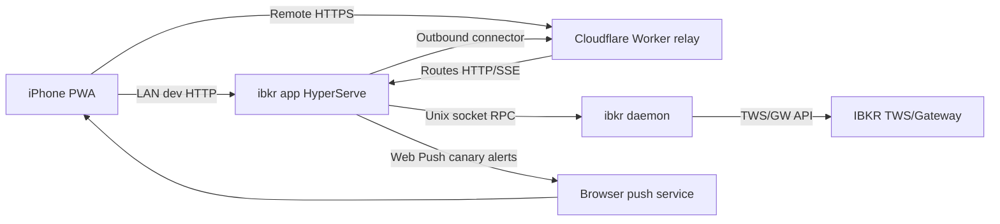

# ibkr Mobile App MVP

Updated: 2026-06-07 22:11 CEST

## Goal

Ship the smallest useful application layer for mobile access to the local IBKR
daemon: a HyperServe-backed `ibkr app` process that serves a paired PWA, streams
live state over SSE, and sends opt-in Web Push canary alerts.

The MVP proves these boundaries:

- A phone can pair with the Mac without receiving a long-lived secret in the QR.
- The browser can render daemon status, account, positions, canary state, alert
  history, and debug-only tools.
- Live account, positions, status, and canary changes flow through one snapshot
  cache and SSE fanout.
- Canary alerts are explicitly enabled by the user and pushed with redacted
  payloads.
- Remote access can use the Cloudflare Worker relay; HTTP MCP is not part of
  this release.

## First Connection

1. The user starts the host with `ibkr app` or installs it with `ibkr setup app`.
2. On the Mac, `ibkr app pair` asks the running app host for a short-lived
   pairing session and prints a QR code plus URL.
3. The QR contains a pairing id and nonce, not a durable device or session
   credential.
4. The phone loads the PWA from `IBKR_APP_PUBLIC_URL`. In production this should
   be a trusted HTTPS relay origin. Local HTTP is only a LAN/dev fallback.
5. The browser generates a P-256 ECDSA device keypair with Web Crypto.
6. The browser signs the pairing nonce and submits the public JWK, nonce, and
   signature to `/api/pairing/complete`.
7. The Mac-side app verifies the nonce proof, stores the device grant locally,
   and returns a short-lived session cookie.
8. The browser fetches `/api/bootstrap`, opens `/api/events`, and stores the
   private key in IndexedDB for future challenge login.
9. If the user enables alerts, the PWA asks for notification permission and
   stores a Web Push subscription against the device grant.

## Runtime Shape

`internal/app/live` is the only polling loop. It owns the current snapshot and
publishes events. HTTP handlers read from that snapshot instead of calling the
daemon directly.

## MVP Surfaces

Main PWA dashboard:

- Daemon/gateway status.
- Account summary.
- Positions summary.
- Canary state and alert history.
- Alert mode: `none`, `act_only`, `watch_and_act`.

No debug diagnostics, quote, chain, scan, size, regime, trading forms, or HTTP
MCP are implemented in the MVP.

## Security Model

- Pairing session creation is loopback-only.
- Pairing URLs expire quickly and are consumed once.
- Device grants store only public keys.
- Browser sessions are short-lived cookies with `HttpOnly` and `SameSite=Strict`.
- Push payloads are deliberately redacted and do not include symbols, holdings,
  account value, or proposed order details.
- Device revocation is represented in state, but a UI for revocation is future
  work.
- Relay compromise must not grant daemon access by itself; the browser still
  needs a valid device key and session.

Threats considered for MVP:

- Stolen phone: revoke the local device grant; session expiry limits exposure.
- Leaked QR: short expiry, nonce proof, one-time consumption, and loopback-only
  session creation reduce the useful window.
- Push endpoint leakage: payloads are redacted.
- Relay compromise: relay is transport only in MVP.
- Daemon unavailable: app renders source errors and keeps auth/debug surfaces
  reachable.

## Repo Boundaries

- `cmd/ibkr/app.go`: CLI entry for serving and pairing.
- `internal/app`: composition, config, lifecycle, and dependency wiring only.
- `internal/app/http`: HyperServe routes, middleware, DTO edge, SSE.
- `internal/app/auth`: pairing sessions, device grants, challenges, sessions.
- `internal/app/state`: durable local JSON state.
- `internal/app/daemonclient`: narrow adapter over daemon RPC.
- `internal/app/live`: polling, snapshot cache, change detection, fanout.
- `internal/app/alerts`: canary alert policy, dedupe, redaction.
- `internal/app/push`: Web Push sender and subscription validation.
- `internal/app/relay`: outbound remote relay connector and pairing URL routing.
- `cloudflare/remote-relay`: Cloudflare Worker + Durable Object relay transport.
- `web/app`: PWA assets, service worker, manifest.

These boundaries are intentionally small so future agents can work in one layer
without editing daemon, MCP, CLI renderers, or browser code unnecessarily.

## Deferred

- HTTP MCP over the app transport.
- Mac-side pairing approval UI.
- Device-management UI and revocation workflow.
- Trading approvals and any two-way atomic risk-manager workflow.
- Android support.
- Mac sleep mitigation beyond documenting that alerts require the Mac, TWS/GW,
  and `ibkr app` to be awake.
