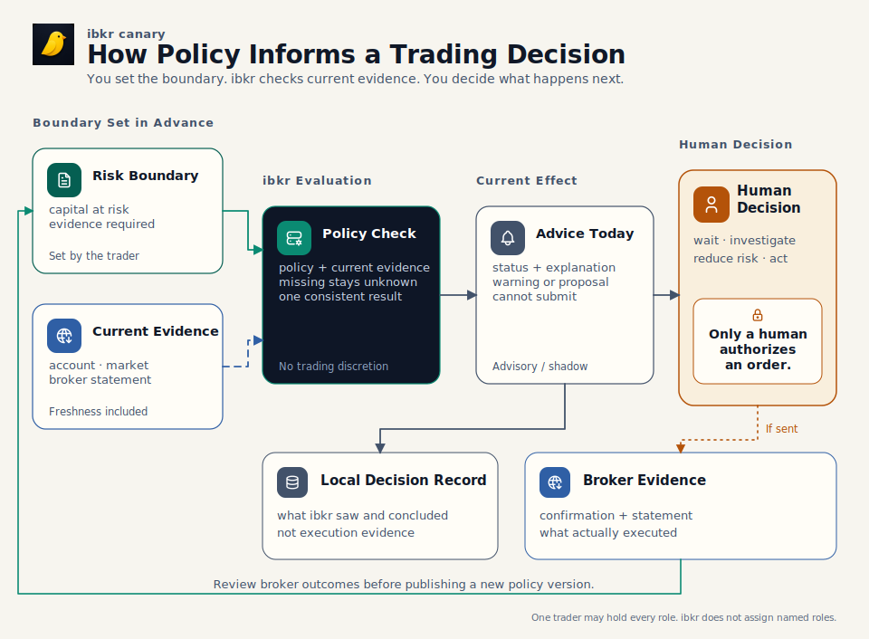
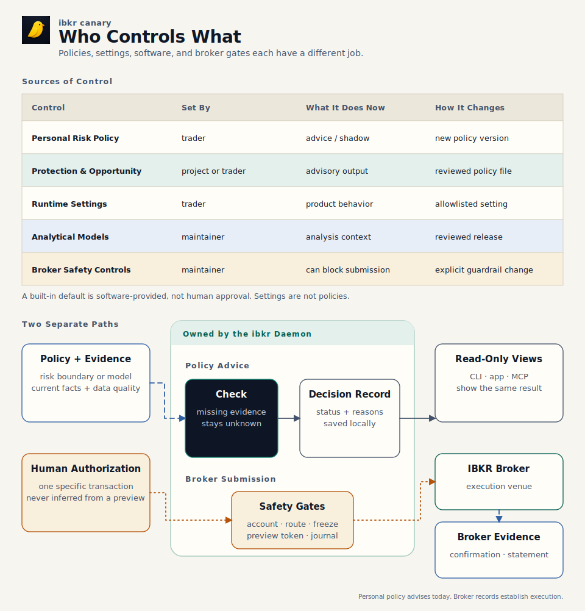

# Trading Policy in ibkr: Who Decides and What the System Does

You decide how much capital may be at risk, which evidence must be current,
and when uncertainty requires attention. Today, `ibkr`'s personal risk policy
observes, explains, and records those decisions; it does not block or authorize
an order. Every submission remains a transaction-specific human decision and
must pass separate, code-owned safety controls.

That separation matters. A local record explains what `ibkr` observed and
decided. Broker confirmations and statements establish what actually executed.
Missing or unusable evidence remains unknown rather than being treated as safe.

For one trader, policy is a promise made while calm and applied under pressure.
One person may own the capital, trade it, and review the result. `ibkr` does not
implement named-user roles or maker/checker approval. A larger desk can reuse
the decision concepts, but it needs an additional identity and approval layer.

## From Risk Decision to Human Action

[](diagrams/policy-lifecycle.svg)

[PNG fallback](diagrams/policy-lifecycle.png) ·
[SVG source generator](diagrams/render-architecture.mjs) ·
[Tabler Icons license](diagrams/ICON-LICENSE.txt)

The human chooses the boundary before the market creates pressure. The daemon
combines that policy with current evidence and returns a structured advisory or
shadow result. The human decides what to do. Outcomes may justify a deliberate
higher policy version, but they never rewrite the active policy by themselves.

> A policy result, proposal, or preview is never permission to submit an
> order.

## A Concrete Example

Suppose the last accepted equity reading is near a declared drawdown boundary,
but the evidence needed to rely on the current result has become stale. `ibkr`
must disclose stale or unknown input rather than report a pass. In shadow mode
it can record the condition and show what the declared response would mean; the
personal risk policy still does not change submit eligibility.

The trader decides whether to wait, investigate, reduce risk, or take another
explicitly authorized action. Separate broker-write controls—route and account
pins, freeze state, preview-token checks, broker WhatIf/eligibility, journal
health, daemon authorization, and origin gating—remain binding. If an order is
submitted, the broker confirmation and later statement establish what
executed. The local policy record explains the context; it is not execution
evidence.

This one situation shows the point of policy: consistent treatment of a known
boundary, honest uncertainty when evidence is unusable, and a clear human
decision boundary.

## Where Controls Live and Who Changes Them

[](diagrams/policy-authority.svg)

[PNG fallback](diagrams/policy-authority.png) ·
[SVG source generator](diagrams/render-architecture.mjs) ·
[Tabler Icons license](diagrams/ICON-LICENSE.txt)

Policy, settings, analytical models, and broker safety controls are different
sources of control. Current evidence is an input, not another policy. The
daemon owns evaluation and publishes one structured interpretation wherever a
surface exposes that decision.

| Source of control | Decision owner and source of record | If absent | Effect today | How it changes |
|---|---|---|---|---|
| Personal risk policy | Human-owned `~/.config/ibkr/policies/risk-policy.toml`; called the risk constitution in code and schema | Material choices remain `unapproved` | Advisory or shadow capital, drawdown, evidence, reconciliation, cadence, and exception results | Edit approved values and raise `policy_version` |
| Protection and opportunity policy | Human-customizable TOML, otherwise a system-provided embedded default | The embedded default is usable, but it is not evidence of human approval | Shapes defensive proposals and option-exercise opportunity detection | Print the default, review it, save a custom file, and raise `policy_version` |
| Runtime settings | Human-operated typed settings stored by the daemon in `daemon.db` | The reported config or build default remains visible | Controls product features and allowlisted overrides; settings are not policy files | `ibkr settings set`, Settings UI, or typed API; freeze and trading-limit changes remain human-only |
| Analytical models | Reviewed code and typed contracts | Present in the installed binary | Calculates Rulebook, Regime, Canary, and related results | Reviewed code and release change |
| Broker safety controls | Explicit human transaction decision plus non-overridable daemon/code checks | The path stays unavailable | Can block a broker write; cannot be weakened by policy or settings | Exact human decision plus reviewed guardrail change where applicable |

MCP exposes research and preview surfaces, not broker-write tools. An agent may
use the gated CLI only after an explicit transaction-specific instruction from
the user in that turn. Apps and dashboards render daemon results; they do not
create policy or submission authority.

## How Policy Versions Behave

Within one running daemon, policy managers apply a simple rule:

1. A valid first file or a valid higher `policy_version` is accepted.
2. Identical content at the accepted version continues unchanged.
3. Different content at the same or a lower version reports drift and keeps the
   last accepted in-memory version.
4. Invalid syntax, unknown keys, or failed validation report an error and keep
   the last accepted in-memory version where one exists.
5. Removing an active personal risk-policy file reports `absent`; deletion is
   not a retirement command.

There is an important restart boundary: accepted policy heads and exact policy
content are not currently persisted as durable policy artifacts. A new daemon
starts with no in-memory accepted version. A valid same-version file changed
while the daemon was stopped can therefore be accepted on startup. If a custom
protection or opportunity file is absent at startup, its engine can use the
embedded default.

Drift detection is consequently runtime-local today. Always raise the version
for a material edit and retain the exact applied TOML outside `ibkr`. The
daemon's status tells you what it currently loaded; the human-owned TOML
remains the policy source.

A content fingerprint is a deterministic ID of the normalized policy fields.
It supports semantic equality checks; comments and formatting do not affect
it. It does not reconstruct historical policy by itself: current durable
events retain policy identity, version, and fingerprint, not the complete
normalized policy body. Historical replay therefore also requires the exact
archived policy content.

## Configure the Available Controls

### Personal risk policy

The personal risk policy has no embedded default and no path override. Start
from [the checked-in template](../examples/risk-policy.toml); material numerical
choices are intentionally commented out so software cannot invent them.

Its main sections cover capital and the protected floor, drawdown response,
bounded human exceptions, statement reconciliation, operating cadence, and
approved sibling model identities. Schema version 1 accepts `advisory` and
`shadow`; it rejects hard drawdown enforcement. Effective risk capital is the
lesser of declared risk capital and equity above the protected floor.

Inspect the current result with:

```sh
ibkr policy show
ibkr policy show --explain
ibkr policy show --json
```

`--explain` shows units, effective values, input health, drawdown state,
reconciliation, active exceptions, cadence, referenced model identities, and
the current content fingerprint. Mutating governance commands under
`ibkr policy` are human-only actions, not agent configuration shortcuts.

### Protection and opportunity policies

These advisory engines ship with conservative embedded defaults. To customize
one, print the exact current schema, review it, and save a higher-version file:

```sh
mkdir -p ~/.config/ibkr/policies
ibkr policy default protection > ~/.config/ibkr/policies/protection-policy.toml
ibkr policy default opportunity > ~/.config/ibkr/policies/opportunity-policy.toml
```

The default paths and every editable key are in the
[configuration reference](reference/config.md). A proposal or opportunity
remains evidence for a human decision. `authority.auto_submit` must remain
false.

### Runtime settings

Settings control live product behavior; they do not create a new policy rule:

```sh
ibkr settings show
ibkr settings show --json
ibkr settings set <key>=<value>
ibkr settings set <key>=null
```

`null` removes an override and exposes the underlying config or build default.
Every typed setting reports its source and whether it is writable. No setting
can bypass the non-overridable broker controls. See
[Platform Settings](design/platform-settings.md) for the ownership contract.

## Read Status and Commissioning Correctly

These words describe different facts:

| State | Meaning |
|---|---|
| Human-approved | A person with the desk's decision responsibility accepted the choice. Structural validity or an embedded default does not prove this. |
| Valid | The file matches its schema and internal rules. |
| Active | The running daemon is using that version now. |
| Commissioned | The complete evidence, evaluator, reporting, and operator path has been proven for its intended use. |
| Enforced | The result actually constrains a path. The personal risk policy is advisory/shadow today; separate broker controls are enforced. |
| Delivered | A result reached its intended surface or alert channel. An evaluator can be active while delivery is inactive. |

Do not infer enforcement or delivery merely because a schema, evaluator, or UI
label exists. Typed status is operational evidence about what the daemon has
loaded, evaluated, or commissioned; it is not the source of human policy.
Missing, stale, partial, or contradictory required evidence is an explicit
unknown or data-quality state, never an implicit zero or pass.

## Single Trader Now, Family Office Later

For one trader, capital owner, trader, and reviewer are responsibilities held
by the same person. That keeps the workflow direct without weakening the human
submission boundary.

The decision model can inform a family office, but the current implementation
cannot become one merely by assigning the labels to several people. It lacks
named principals, role permissions, maker/checker approval, multi-account and
book semantics, and consolidated reporting. A larger desk needs authenticated
identities, scoped approvals, durable actor records, and a separate control
layer before those responsibilities become system-enforced governance.

## Change a Policy Safely

For a material policy-file change:

1. Read the current typed status and retain the exact current file, version,
   and fingerprint.
2. Change only values the human decision owner has approved.
3. Raise `policy_version`; never reuse a version for different content.
4. Wait for reload or use the normal operator restart path.
5. Re-read status and confirm the expected source, active version, fingerprint,
   effective values, input health, and absence of drift or error.
6. Exercise the affected read or preview path. A new enforcement rule needs
   replay or shadow evidence and a separate explicit promotion decision.

For a setting, inspect its access and source, change one allowlisted key, and
read it back. For a code-owned model or safety control, use a reviewed release
change. Routine clean cases should be automated; only exceptions should return
to the human.

## Glossary and References

- **Advisory:** guidance that does not block or submit an order.
- **Shadow:** evaluation and recording without enforcing the result.
- **Submit authority:** an explicit human decision for one transaction; a
  policy result, proposal, preview, or token is not that authority.
- **Content fingerprint:** an ID derived from normalized policy fields; it
  deliberately ignores comments and formatting and must accompany retained
  content when historical reconstruction matters.
- **Freshness:** whether evidence is recent enough for the decision.
  **Finality:** whether its source can still revise it.
- **Local decision record:** what `ibkr` observed, evaluated, or attempted.
  **Broker execution evidence:** confirmations and statements describing what
  the broker executed.
- **Unapproved:** a material human choice has not been made; it is not zero,
  safe, or default.

Detailed references:

- [Configuration Reference](reference/config.md): every configuration,
  advisory-policy, runtime-setting, and environment key.
- [Risk Constitution Design](design/risk-policy.md): capital,
  reconciliation, safety invariants, and implementation history.
- [Trading Rulebook](design/trading-rulebook.md): compiled discipline checks.
- [Trading Harness Development](guides/trading-harness-development.md): how to
  design, shadow, promote, and reconcile a new control.
- [Architecture](architecture.md): daemon, RPC, adapter, and broker ownership.
- [Storage](database.md): how applied policy state and local events are stored
  without making SQLite the policy-authoring surface.
