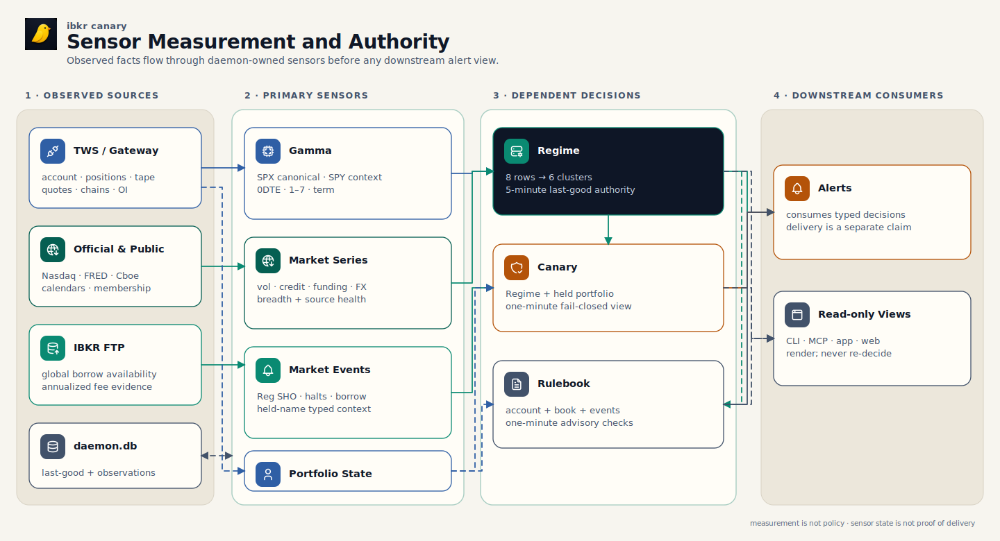
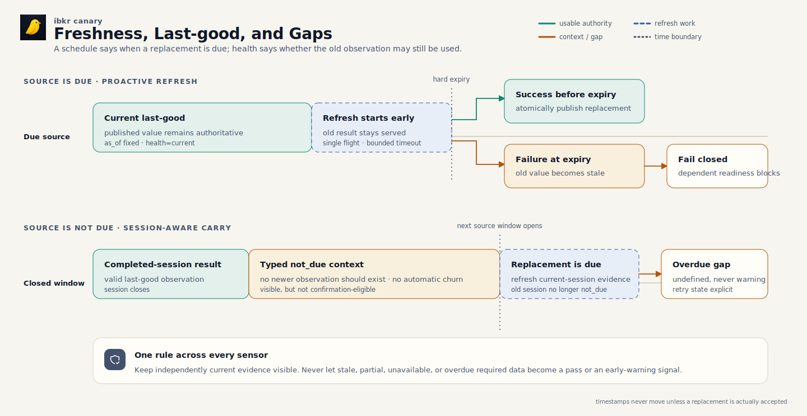

# Sensors: Measurements, Freshness, and Safe Interpretation

Sensors answer questions about the market and the held portfolio. They turn
broker and public-source observations into typed measurements with an `as_of`
time, source health, freshness, and a semantic fingerprint. They do not decide
trading policy, authorize an order, or prove that an alert reached a device.

The daemon is the measurement authority. It owns source access, scheduling,
last-good state, and evaluation. CLI, MCP, app, and web surfaces read the same
typed results; they do not fetch the sources again or recreate the verdict.

This page explains five related sensor families:

- **Gamma** measures dealer-gamma structure for SPX/SPXW, with SPY as context.
- **Regime** combines eight broad-market rows into six independent clusters and
  a market lifecycle.
- **Canary** asks how that exact market state interacts with the portfolio now.
- **Rulebook** applies 14 advisory discipline checks to current desk evidence.
- **Market events** add held-name borrow, threshold-list, and halt context.

## From Measurement to Downstream Use

[](diagrams/sensor-authority-pipeline.svg)

[PNG fallback](diagrams/sensor-authority-pipeline.png) ·
[SVG source generator](diagrams/render-architecture.mjs) ·
[Tabler Icons license](diagrams/ICON-LICENSE.txt)

Sources enter through one daemon-owned path. Gamma is an input to Regime;
Regime and market events are inputs to Canary and Rulebook. Alerts may consume
the resulting typed state downstream, but a sensor result is not evidence that
delivery is active or that a notification arrived.

The boundary is deliberate: a dependent sensor receives the upstream result,
including its health, instead of copying its calculations. Canary therefore
uses the exact Regime publication, and Rulebook uses the daemon's classified
Regime stage rather than rebuilding one from market rows.

## Read the State Before the Number

[](diagrams/sensor-freshness-timeline.svg)

[PNG fallback](diagrams/sensor-freshness-timeline.png) ·
[SVG source generator](diagrams/render-architecture.mjs) ·
[Tabler Icons license](diagrams/ICON-LICENSE.txt)

Freshness is part of the measurement. The daemon refreshes before a result's
hard expiry where the source permits it. A successful refresh atomically
replaces the last-good publication. A failed refresh leaves the older result
visible with explicit health; it never changes an old value's timestamp or
turns absence into zero.

These words describe different conditions:

| State | Meaning | Safe interpretation |
|---|---|---|
| `current` | The source refresh is complete and no newer observation is due. | Use the value subject to its quality and scope. |
| `not_due` | The source's publication or trading window is closed, so no newer observation should exist yet. | Keep valid last-good context visible, but do not promote it to fresh confirmation. |
| `partial` | Some expected fields, symbols, or child sources arrived and others did not. | Use only the explicitly complete part; absence elsewhere is unknown. |
| `stale` | A known value is older than its allowed evidence window or a due refresh failed. | Display as old context; dependent decisions normally degrade or block. |
| `unavailable` | No usable value exists for the requested scope. | Do not infer a neutral, inactive, or passing result. |
| `degraded` | The result exists, but source or model quality limits how it may be used. | Read the blocker and use only the permitted context. |
| `computing` | A background calculation is running and no completed replacement can yet be served. | Wait or poll; progress is not a measurement. |
| `overdue` | The native cadence says a newer observation should already exist. | Treat required evidence as a data-quality failure, not a warning signal. |

`not_due` and `overdue` are opposites. `not_due` is an expected schedule gap;
`overdue` is a missed obligation. Likewise, `partial` describes incomplete
coverage, while `stale` describes time. One source can be both incomplete and
old at different layers of a result.

## Sensor Map

| Sensor | Question answered | Authoritative inputs | Main output | Evaluation and freshness |
|---|---|---|---|---|
| Gamma | Where does the modeled dealer book switch between amplifying and damping moves, and where is gross gamma concentrated? | IBKR SPX/SPXW and SPY option contracts, prices or derived IV, open interest, spot, and the US options calendar | Per-index zero-gamma, gap/distance, signed profiles, 0DTE/1–7/term splits, total absolute gamma, top strikes, agreement, and rankability | Multi-minute background compute; 15-minute refresh-while-served during options RTH; closed-session last-good does not churn |
| Regime | Is broad-market stress quiet, emerging, confirmed, panicking, stabilizing, or data-incomplete? | Live IBKR market data, official public series, Gamma, and S&P 500 breadth | Eight rows, six clusters, posture, lifecycle, source health, eligibility, governors, and fingerprint | One immutable five-minute last-good publication; proactive refresh starts about one minute before expiry |
| Canary | Does the current market state matter to the portfolio actually held? | Current account, positions, the exact Regime publication, and held-name market events | Action, market confirmation, portfolio fit, input health, planner readiness, held stress, and fingerprint | Stateless evaluation every minute; required input gaps fail closed |
| Rulebook | Which declared daily discipline checks pass, need attention, or cannot be evaluated? | Account, positions, earnings, classified Regime stage, and SPY tape | 14 ordered rows, hardest-first ranking, counts, input health, offenders, and evidence | Canonical evaluation every minute; scope-bound cache is reusable for 75 seconds, including previews |
| Market events | Does a held or requested name have borrow, threshold-list, LULD, or halt context? | Nasdaq Reg SHO and halt feeds, IBKR shortable inventory, IBKR FTP borrow fees, and diagnostic TWS history for exact held shorts | Typed flags, per-source health, borrow-fee coverage, warnings, and fingerprint | Source-specific cadence: one minute to daily; failures retain typed retry and last-good state |

## Gamma

### What it answers

Gamma estimates how the aggregate options-dealer book may respond as the
underlying moves. The signed profile looks for a zero crossing: below that
level the modeled book is generally amplifying; above it, generally damping.
The result is a market-structure hint, not a precise trade level.

SPX/SPXW is the canonical S&P 500 signal. SPY is corroborating ETF context.
The default `spy+spx` result keeps separate per-index price levels because SPY
and SPX use different scales; there is intentionally no combined top-level
spot or zero-gamma price. A healthy SPX result remains usable when SPY is
throttled or unavailable. SPY-only remains a labeled proxy when SPX is absent.

### Inputs and outputs

The daemon qualifies option contracts, collects option prices or derives IV,
captures open interest, and anchors the sweep to observed spot. Missing open
interest is unknown, never zero. Priced legs can support the IV/skew fit but do
not contribute open-interest-weighted exposure without observed OI.

Each per-index result reports:

- zero-gamma status, zero-gamma price when a crossing exists, and spot's
  percentage gap from it;
- the full signed profile and the swept spot range;
- separate 0DTE, 1–7 DTE, and term profiles and crossings;
- `gamma_total_abs`, the sign-agnostic gross gamma magnitude, and `top_strikes`,
  the largest absolute concentrations;
- priced and contributing leg counts, OI/IV/skew coverage, warnings, and
  `quality.rankability`.

Only `rankable` may contribute a Regime band or confirm stress. `context_only`
is displayable but does not vote. `blocked` and `unavailable` are not usable
signals. Missing 0DTE is disclosed but does not by itself block a healthy SPX
surface when 1–7 DTE and term coverage are present.

Some Gamma quality bars, including skew-fit quality, remain heuristic pending
calibration from retained diagnostics. The result exposes the gate and reason;
it does not present those bars as proven thresholds.

### Timing and last-good behavior

After the gateway becomes ready, the daemon prewarms canonical combined Gamma
and checks refresh eligibility every minute. A request without a serveable
result returns `computing` with progress and an ETA. Concurrent callers for the
same scope share that work. During regular US options hours—normally
09:30–16:15 ET—a successful result becomes due for refresh after 15 minutes.
The daemon keeps serving the last-good result while the replacement computes,
promotes only a successful replacement, and backs off repeated failures.

The 15-minute interval is the refresh trigger, not the direct quality ceiling.
During RTH, standalone Gamma rankability requires a current-session result no
more than 60 minutes old. During a closed session, a cache no more than 24 hours
old can remain rankable on the direct surface.

Outside options RTH, automatic refresh is intentionally suppressed. The direct
Gamma surface can keep a sufficiently recent closed-session cache rankable.
When Regime consumes that same result, however, the latest completed-options-
session value is typed `not_due` context before the next open and cannot
confirm. When the next options session opens, that prior-session result becomes
overdue unless a current-session compute replaces it. No last-good result, a
missed completed session, or a due refresh gap is a data-quality condition.

The authoritative cadence is a same-session 15-minute RTH refresh trigger,
served last-good during refresh, and off-hours Regime `not_due` context.

### Safe check

```sh
ibkr gamma --json
ibkr gamma --only spx --json
```

Read `status` first, then `result.quality.rankability`, `as_of`, session keys,
coverage, and `warning_details`. Use `--force` only for an intentional
diagnostic recompute; it is not the normal freshness mechanism.

## Regime

### What it answers

Regime asks whether several independent market channels agree that stress is
developing. Its eight rows form six clusters:

| Cluster | Rows | What it measures |
|---|---|---|
| Volatility | VIX/VIX3M term structure; VVIX | Equity-volatility inversion and demand for convexity |
| Credit | HYG/SPY divergence; HY/IG option-adjusted spreads | Fast ETF credit pressure plus slower official cash-credit confirmation |
| Funding | Commercial-paper/T-bill spread | Funding and liquidity pressure |
| FX | USD/JPY weekly move | Yen-funded carry unwind pressure |
| Gamma | SPX-canonical dealer gamma with SPY context | Whether modeled dealer hedging may amplify or damp moves |
| Breadth | S&P 500 breadth | Participation above 50/200-day averages and new-high/new-low balance |

Each row carries measurements, band, reason, source and scalar provenance,
native-cadence freshness, streak, and red-band eligibility. The combined result
reports raw and confirmed cluster counts, source health, posture, and one of
`quiet`, `early_warning`, `confirmed_stress`, `panic`, `stabilization`,
`opportunity`, or `data_quality`.

Red does not automatically mean confirmed. Depth, persistence, freshness, and
cluster independence decide whether a red row may confirm stress. A
provisional red stays visible. It may support `early_warning` only when the
required evidence set is otherwise usable. Missing, broken, contradictory, or
overdue required evidence instead produces `data_quality`, blocked readiness,
and “Market state undefined — data incomplete.”

Thresholds and severity governors currently labeled `heuristic` and
`pending_backtest` are exactly that: reviewed starting assumptions awaiting
point-in-time calibration. They are not proven market laws. The result exposes
governors so a lower severity beside red rows is explainable rather than
silently rewritten.

### Timing and authority

Regime publishes one immutable, daemon-owned last-good result to `daemon.db`.
Its operational authority window is five minutes. A daemon scheduler checks
every five seconds and starts a refresh about one minute before expiry, leaving
the full 45-second acquisition budget plus a cushion. A Gamma publication can
also wake Regime promptly. App polling and alert consumers do not own this
schedule.

Two slower inputs use their own publication clocks. After VIX3M dissemination
closes, the frozen VIX term observation remains visible but the volatility
source is healthy and `not_due` when VVIX is current; it is not a stale-source
warning. S&P 500 breadth starts after the official equity close plus a 35-minute
settlement delay. A full broker-paced pass can take about 74 minutes, so the
immediately prior last-good is healthy `not_due` context only while an active
refresh or retry remains inside the explicit 90-minute publication window. It
becomes stale at the deadline if a current-session result has not published.

Breadth counts only constituent windows whose last bar matches the requested
trading session. Successful windows are checkpointed every ten names, so a
restart resumes near its last completed work instead of repeating the whole
fan-out. The result exposes refresh start, processed and total names,
publication deadline, and a redacted failure reason. These fields describe
work progress; they never make an incomplete snapshot current.

Only a complete replacement becomes current. While refresh runs, consumers see
the prior publication with `refreshing` authority health. A failed refresh
keeps the last-good result but marks authority stale with the typed failure and
retry state. A cold start with no valid publication is unavailable. Dependent
sensors receive this authority health and must not present a stale publication
as current.

### Safe check

```sh
ibkr status --json
ibkr regime --json
ibkr regime --explain
```

Check Regime authority health, `as_of`, lifecycle readiness, each cluster's
`source_health`, row freshness and eligibility, then `governors`. A green row
does not prove the whole result is usable when another required cluster is
overdue.

## Canary

### What it answers

Canary asks whether the current broad-market state is relevant to the current
book. It combines four daemon-owned inputs: account, positions, the exact
published Regime result, and market events for held names. It does not fetch a
second market view or use the portfolio's own losses to “confirm” a broad
market event.

The output separates `market_confirmation`, `portfolio_fit`, and
`input_health`, then derives an action such as `stand_down`, `watch`, `defend`,
`rebalance`, `deploy`, or `confirm_inputs`. It also reports planner readiness,
bounded held-name stress, source health, drivers, warnings, and a semantic
fingerprint.

### Timing and fail-closed prerequisites

The daemon evaluates Canary every minute, even when the app is closed.
Evaluation is stateless; retained decision events are history, not an alternate
current authority. During pre-market and RTH, account and positions observations
older than 10 minutes are stale; outside those phases the limit is 90 minutes.
Regime must carry usable last-good authority, and market-event source health
must remain explicit.

The account timestamp still requires a completed, account-scoped broker
snapshot. Per-currency ledger rows are accepted only through the broker's
closed, typed ledger field set; aggregate ordinary rows and foreign-account
rows fail closed. Daily P&L is required during the US equity regular session.
If that stream is silent outside the session, it is `not_due` and does not make
otherwise current account evidence unhealthy; the P&L-specific observation
remains explicitly unavailable.

Missing, stale, partial, or failed required inputs produce degraded/failed
input health and normally `confirm_inputs` with blocked readiness. Reg SHO and
halt health are required for a held book; borrow inventory and fee health
become required only when the book contains a short stock. An all-long book
does not fail because short-borrow evidence is absent. Market-only stress
cannot become a portfolio defense instruction without usable portfolio fit,
and portfolio loss or margin pressure cannot manufacture market confirmation.
Independently current evidence may stay visible, but the input gap remains the
headline condition.

### Safe check

```sh
ibkr canary --json
```

Read `input_health`, `action`, and `planner_readiness` before the summary. Then
compare `source_as_of`, `source_health`, the embedded market lifecycle, and held
stress. Use the dedicated account, positions, Regime, or market-events command
to investigate a named gap.

## Rulebook

### What it answers

Rulebook evaluates 14 advisory discipline checks over the current book. Its
inputs are account and positions evidence, per-name earnings evidence, the
classified Regime stage, and current SPY tape where a rule needs it. The pure
evaluator returns all 14 rows in stable order plus a hardest-first ranking,
breach counts, offenders, observed values, thresholds, and evidence.
The detailed [Trading Rulebook](design/trading-rulebook.md) is the semantic
authority; compiled v2 is an advisory model, not proof that every threshold has
operator approval.

Row outcomes are `pass`, `info`, `watch`, `act`, `unknown`, or
`not_evaluated`. Missing or partial input cannot create a false pass. Provider
disagreement or an unresolved earnings source remains unknown. A carried or
stale Regime stage is evaluated conservatively against both the carried and
calm threshold sets, keeping the worse result so old market state cannot relax
a rule.

Outside the US equity regular session, an absent Daily P&L frame is `not_due`,
not an account failure. Rules that have complete account and position inputs
still evaluate; the green-day/P&L rule alone remains `not_evaluated`. During the
regular session, missing or malformed Daily P&L continues to degrade account
health and fail closed.

Fetched earnings evidence is fresh for 24 hours, retained for bounded recovery
up to 45 days, and retried after 15 minutes when a provider attempt fails.
Last-good evidence remains labeled; it never replaces a current successful
provider outcome or resolves disagreement.

### Timing and preview reuse

The daemon owns a complete evaluation every minute, independently of the app.
CLI, app, and preview readers reuse a scope-, connector-, and broker-generation-
bound result for up to 75 seconds. After that, a reader gets a bounded canonical
evaluation or an explicit unavailable advisory; it never silently borrows a
result from another account or connection generation.

Order previews may include Rulebook causes from this cache, but those warnings
remain advisory and do not change broker submit eligibility. A missing preview
warning is not evidence that the underlying input was healthy.

### Safe check

```sh
ibkr rules --all --json
```

Check top-level `status` and every `input_health` row before counting passes.
Inspect `unknown` and `not_evaluated` reasons, policy identity, and the ranked
rows. Do not treat an old preview's annotations as a new Rulebook evaluation.

## Market Events

### What they answer

Market events ask whether a held or requested stock/ETF has single-name
structure that should annotate risk review or protection proposals. The flags
are reduce-only context and safety gates; they do not create opening-trade
recommendations.

| Source | Authority and output | Cadence and failure meaning |
|---|---|---|
| Nasdaq Reg SHO | Latest available Nasdaq threshold-security file; emits `reg_sho_threshold` for covered symbols | Cached fetch for 12 hours; source age may extend to 96 hours. Fetch failure serves labeled stale last-good when present. Absence covers Nasdaq's feed only, not every listing exchange. |
| Nasdaq halts | Nasdaq trade-halt feed; emits active/recent LULD or regulatory/news halt flags | One-minute freshness and one-minute retry. A failed refresh may serve labeled stale records; no current feed means halt absence is not conclusive. |
| IBKR borrow inventory | Generic tick 236 shortable-share observation; emits tight/scarce inventory | Two-minute source window. Missing ticks are unknown; recently absent symbols are re-probed after 30 minutes rather than held false for the day. |
| IBKR FTP borrow fee | Global short-stock availability file; emits extreme annualized fee only from current, policy-eligible evidence | Refreshes during the US equity regular session; 15-minute fresh window, 90-minute maximum age, 15-minute failure retry. Off-hours is typed `not_due` and may serve the latest completed-session last-good. |
| TWS `FEE_RATE` | Exact-contract historical context for currently held short stocks when due FTP evidence is unusable | Portfolio-only diagnostic fallback. Its numeric scale is uncommissioned, nullable, and policy-ineligible; it never creates or clears the global extreme-fee flag. |

The result carries per-source `status`, `refresh_state`, `next_attempt`, and a
redacted typed `last_failure`. Empty `flags` is conclusive only when source
health establishes current, complete coverage. Unknown and null never mean
inactive or zero. Borrow-inventory aggregate health can read `ok` after at
least one requested symbol reports; check the coverage note because other
symbols may still lack a tick.

### Safe check

```sh
ibkr market-events --json
ibkr market-events --symbol GME --json
```

Read `source_health` before `flags`. For borrow fee, inspect
`borrow_fee_coverage` for global versus portfolio-only scope, entitlement,
scale status, and `policy_eligible`. Respect `not_due` and `next_attempt`
instead of repeatedly forcing a blocked source.

## Operator Checklist

Use read-only checks in this order:

1. Run `ibkr status --json` and confirm the gateway, data farms, background
   tasks, sensor subsystems, and top-level data-quality warnings.
2. Open the sensor's own JSON result. Check status, authority or source health,
   scope, `as_of`, freshness, and warnings before interpreting measurements.
3. Follow the named dependency. For example, investigate Gamma before treating
   Regime's gamma row as a problem, and Regime before treating Canary as a
   portfolio verdict.
4. Re-read after the typed retry or publication window. Do not create a fetch
   storm around a source that reports `not_due` or a future `next_attempt`.
5. Treat an alert surface as a downstream view. Sensor health does not prove
   push activation, delivery, receipt, or acknowledgement.

These checks are diagnostic only. None places, modifies, cancels, or authorizes
an order.

## Reference Map

- [Architecture](architecture.md): process, source, RPC, and runtime ownership.
- [Trading Policy](policies.md): who chooses limits and what remains advisory.
- [Trading Rulebook](design/trading-rulebook.md): canonical rule, input-health,
  preview, alert, and authority semantics.
- [Storage](database.md): last-good documents, observations, evidence, and
  recovery boundaries.
- [Concepts](concepts.md): deeper interpretation of calendars, Gamma, Regime,
  Canary, market events, and breadth.
- [Regime and Canary Backtest Plan](specs/regime-backtest-plan.md): evidence
  required to replace pending heuristics with calibrated policy.
- [Risk-Regime Dashboard Specification](specs/risk-regime-dashboard.md): row
  methodology and model detail.
